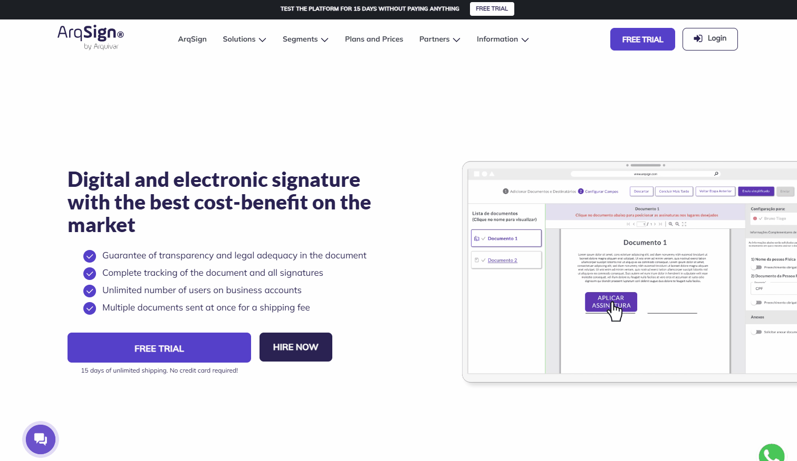

# 💻 Platform Overview 2.5.0

## Platform features

ArqSign is a platform for electronic signatures that works as follows: the user uploads the document, selects the signatories, establishes the signatures, and sends it to those involved in the signing process.&#x20;

The user can access sent and received documents for signature at any time, from anywhere, on any device – mobile phone, computer, tablet – without compromising the security and encryption of data, in accordance with LGPD (General Data Protection Law).&#x20;

ArqSign features the implementation of an API (Application Programming Interface), allowing the user to integrate their Electronic and Digital Document Signature into their company's solutions.&#x20;

The main functionality of the ArqSign platform is to offer users the ability to send, manage, collect, and sign documents digitally, through electronic signatures or digital certificates.&#x20;

The signatory can sign the documents via email, WhatsApp, or their ArqSign account if they have one. &#x20;


<mark style="color:blue;">**ELECTRONIC SIGNATURE VS. DIGITAL SIGNATURE (ICP Brasil and Other Digital Certificates)**</mark>

<mark style="color:blue;">An electronic signature does not require a digital certificate. It is more commonly used for signing contracts and documents between private entities (B2B, B2C).</mark>&#x20;

<mark style="color:blue;">A digital signature requires a digital certificate. It is more commonly used for issuing invoices and for transactions with the government.</mark>&#x20;

<mark style="color:blue;">On the ArqSign Platform, when configuring a signing workflow, you can determine which type of signature should be executed by the recipient by choosing between:</mark>&#x20;

<mark style="color:blue;">a) Electronic signature: ArqSign produces advanced electronic signatures with legal validity according to Provisional Measure 2.200-2 of 08/24/2001 and Law 14.063 of 11/23/2020. Whenever a signatory signs a document electronically, ArqSign applies its own digital certificate, capturing the file's Hash (unique identifier), verifying the integrity of the file, and attaching the signatory's identification to the certificate.</mark>&#x20;

<mark style="color:blue;">b) Digital signature – ICP-Brasil or ICP Others: ArqSign produces qualified digital signatures according to Provisional Measure 2.200-2 of 08/24/2001 and Law 14.063 of 11/23/2020. When the user already has a digital certificate and wishes to use it to sign through ArqSign, this certificate is used to verify the integrity of the signature and identify the user as the signatory on the document</mark>


***

### User and Signer &#x20;

A user is a person who uses the ArqSign Platform to send, monitor workflows, collect signatures, access, and manage documents. A user must be linked to an account, and when they also need to sign a document, they become a signatory.&#x20;

On the ArqSign platform, a user can have the following profiles:&#x20;

* **Document Sender**: A user without access to platform management features, focused on document sending and management.
* **Global Administrator**: A user with access to all platform features, including folder and user management.

A **Signer** is an individual or legal entity participating in the signing process (signing a document). The signer does not need an account or user access on the ArqSign Platform to sign a document.

***

### ArqSign Platform Website &#x20;

The ArqSign website ([https://arquivar.com.br/arqsign/](https://arquivar.com.br/arqsign/)) provides all platform information and features, including subscription plan details. On the homepage, users can also access the platform's login page and create a free trial account.

<figure><figcaption></figcaption></figure>

***

### Technical Support and Customer Service &#x20;

To request support or assistance, click on "Support" in the bottom menu of the page.

<figure><figcaption></figcaption></figure>

The user will be directed to the platform's Help Center, where they can search through posted content for a solution to their question or request contact with the support team.

<figure><figcaption></figcaption></figure>

Contact with the support team can be made via WhatsApp, chat, email (faleconosco@arqsign.com), or phone (4003-8839).

<figure><figcaption></figcaption></figure>

After authentication, the user will also have access to the support menu on the platform, located at the bottom right corner of the screen.

<figure><figcaption></figcaption></figure>

***

## Subscription Plan Features&#x20;

### Free Plan &#x20;

The free trial account on the ArqSign Platform provides users with nearly all the features and resources of the paid account, including sending documents for signing with or without a digital certificate, creating dedicated folders for document management, importing the ICP-Brasil A1 digital certificate, and integration with other systems. For a 15-day period, users can send up to five documents for signing at no cost.


<mark style="color:orange;">**In the free trial account, adding other users is not allowed; only the account owner can access and manage documents sent and received for signing.**</mark>

<mark style="color:orange;">**Creating a free trial account is permitted for any user whose email has not been registered for other free trials on the ArqSign platform.**</mark>


#### Creating a Free Trial Account

1. To create a free trial account, on the homepage of the ArqSign platform website, click on "Free Trial".

<figure><figcaption></figcaption></figure>

2. The user will be redirected to the login page, where they should enter their email and click “Start Now.”

<figure><figcaption></figcaption></figure>

3. Next, provide the requested information:&#x20;

* **Full Name:** Enter your full name.&#x20;
* **Phone:** Enter your phone number with area code.&#x20;
* **Business Segment:** Select the industry in which the company or the account owner operates.&#x20;
* **Testing ArqSign for:** Choose the purpose of the test to be conducted on the ArqSign platform.&#x20;
*   **Password:** Create a password following the minimum security requirements (at least eight characters, including at least one uppercase letter, one lowercase letter, one number, and one special character). &#x20;

    <figure><figcaption></figcaption></figure>

To complete the process, click on&#x20;

4.  To finish, click on “Start My Free Trial.” A confirmation message for account creation will appear. To access the platform, click the provided link.

    <figure><figcaption></figcaption></figure>
5. The user will be directed to the login screen, where they should enter the password created during registration and click on "Acces My Account" to complete the initial access.

<figure><figcaption>
Click on the image to enlarge.
</figcaption></figure>


<mark style="color:orange;">**At the end of the 30-day trial period or after using the ten free document submissions, the user can continue accessing the platform as usual. However, to make new submissions, they will need to purchase a paid plan (for sending documents via email) or buy additional credits (for submissions via WhatsApp and SMS).**</mark>


***

### Paid Plans&#x20;

When subscribing to an ArqSign plan, you will have access to a specific number of submissions according to the plan. Submissions included in the plan can be made via email or WhatsApp.

&#x20;For sending workflows via WhatsApp, the account must have submission availability and credits for WhatsApp, as this is done through an integration with the official WhatsApp. To purchase WhatsApp credits, once logged into the platform, go to the "Buy Credits" menu. Charges will be based on message submissions. For each workflow, two messages are used per signer (one to send the document for signing and one to send the signed document at the end of the process).

For sending workflows via email, the account must have submission availability, as the ArqSign platform itself handles sending the workflow. If the submissions included in the user's plan are exhausted, they can also purchase additional email submission credits by accessing the "Buy Credits" menu after logging into the platform.

All paid plans offer the same features. The only difference is the number of submissions in each package and the availability of annual and monthly plans.

#### Billing for Paid Plans &#x20;

The billing basis for each plan is the service of sending a workflow for signing. One workflow submission may contain multiple files and signatures, but it will still count as a single submission.

For monthly plans, you pay a subscription fee when subscribing and can immediately start using the tool. The monthly fee will be automatically charged on the same day of purchase every month unless you disable auto-renewal.

For annual plans, there is an option to purchase in up to 12 installments without interest on the card.

#### Purchasing a Plan&#x20;

1.  To purchase a plan, go to the ArqSign website's homepage and click on "Plans and Prices" in the top menu. &#x20;

    <figure><figcaption></figcaption></figure>
2.  The features and prices of each plan will be presented. Click on "Start Now" for the plan you wish to purchase.

    <figure><figcaption></figcaption></figure>
3.  The user will be directed to the checkout page, where the details of the chosen plan will be displayed. They should enter their billing and payment information and click "Complete Purchase."

    <figure><figcaption></figcaption></figure>
4. After the payment is made, the user will receive an email with the activation link for the account, which they should click to complete the first login.

***

## Login Page (Authentication) on the ArqSign Platform&#x20;

The login page of the ArqSign platform asks for the email and password registered by the user when creating their account.

If the user does not yet have an account, they should click on the link “Register here".

<figure><figcaption>
Click on the image to enlarge.
</figcaption></figure>

The user will be offered the option to [create a free trial account](https://arquivar.gitbook.io/manual-arqsign#criacao-de-conta-teste-gratis). To create this account, they must provide their email and click “Next.”

### Forgot my password&#x20;

&#x20;If the user forgets their password, they can simply click on “Forgot my password.”

<figure><figcaption>
Click on the image to enlarge.
</figcaption></figure>

On the password recovery screen, the user must enter the same email used to access the platform and click "Recover."&#x20;

<figure><figcaption></figcaption></figure>

The user will receive an email containing a link that they should click to set a new password.

<figure><figcaption></figcaption></figure>

***

## Homepage - Logged-In User &#x20;

Upon accessing their account, the user will see the following buttons in the top menu:

**New Document**: Clicking this button allows the user to upload a document to be sent to signatories for signing.

**Batch Signing**: Clicking this button allows the user to view and sign all documents received that are pending signature.

**Expired**: Clicking this button allows the user to view all documents they sent to others for signing but that were not signed within the deadline and have expired. Here, the user can resend those documents.

**Buy Now / Change Plan**: The "Buy Now" or "Change Plan" buttons will be displayed for users with a free trial account or users with an expired or soon-to-expire paid plan. The "Buy Now" button will be shown for users with an expired plan, while the "Change Plan" button will be shown for users with a paid plan nearing expiration (30 days before the expiration of annual plans and 10 days before the expiration of monthly plans).

**Buy Credits**: For accounts with an active plan, the "Buy Credits" button will be displayed, allowing the user to purchase credits for sending documents via email, WhatsApp, and SMS, depending on the account’s plan type.

**User Profile**: Clicking this menu gives the user access to their account information.

**Languages**: The homepage and platform interface will be presented in the language chosen by the user during registration. To change the language, click the flag icon located in the upper-right corner of the screen and choose between Portuguese (Brazil), Spanish, and English.

**Logout**: Used to log out of the platform.

<figure><figcaption></figcaption></figure>

On the left side of the screen, we have all the available menus, organized by groups. It is important to note that these menus will be displayed according to each user's permission level.

**Inbox**: This group contains menus related to the document processing workflow.

**Directories**: This group includes the **Documents** menu, which serves as a storage repository for documents processed by the platform. Here, all documents with completed signature processes can be found.

**Administration**: This group contains account settings, user management, and user group configurations.

<figure><figcaption></figcaption></figure>
