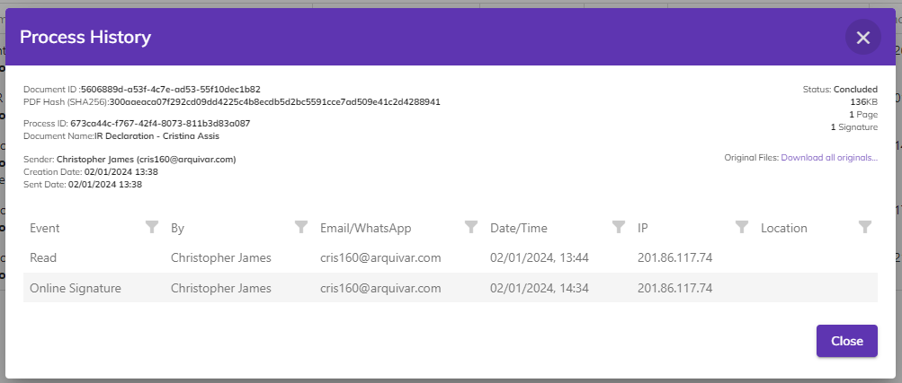
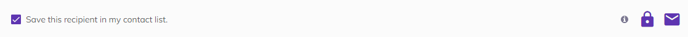
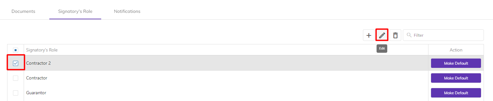
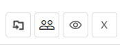
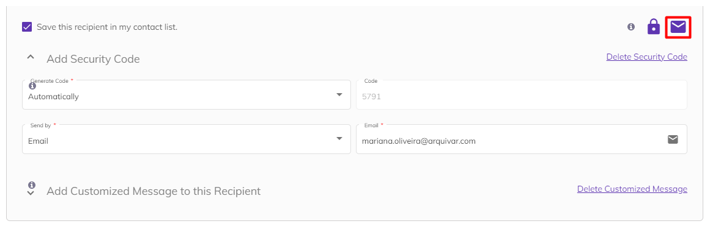
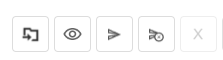
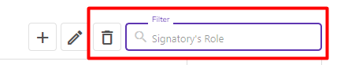
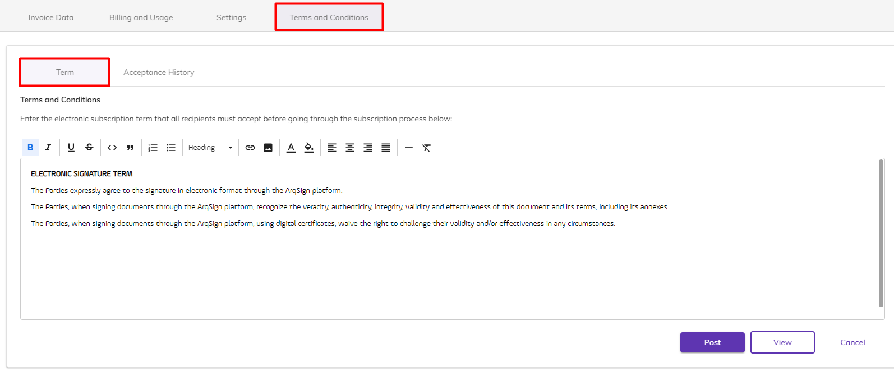
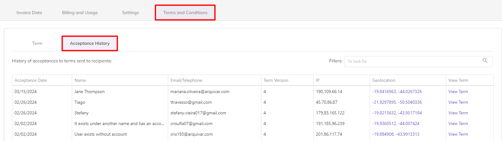

# 🟪 Account

The Account menu contains information about the user’s account.

<figure><figcaption>
Click on the image to enlarge.
</figcaption></figure>

***

## Fiscal Data Tab&#x20;

In the Fiscal Data tab, users can view their fiscal and financial information. The data entered when creating an account and purchasing a plan on the ArgSign platform are displayed here.

If the user's account is on a free plan, the fields will be blank but can be edited by clicking the "Edit" button.

<figure><figcaption>
Click on the image to enlarge.
</figcaption></figure>

In this tab, the following user information is displayed:

* **Account Name:** The name created for the account during registration on the platform. It could be, for example, the user's name or the name of the company that owns the account.&#x20;
* **Segment:** The professional segment in which the user or company operates.&#x20;
* **Number of Employees:** The number of employees in the user's company.&#x20;
* **Registration Type:** The type of registration for the account, which can be CPF (Brazilian ID), CNPJ (Brazilian company registration number), or others.&#x20;
* **Registration Number:** The registration number for the account, which should be filled in according to the option chosen in the "Registration Type" field.&#x20;
* **Default Language for New Users:** The language in which the platform will be presented to new users associated with the account, which can be Portuguese, English, or Spanish.&#x20;
* **Address:** The residential or commercial address of the user or company.&#x20;
* **Number:** The number of the residence or commercial property.&#x20;
* **Complement:** The complement of the address.&#x20;
* **Postal Code:** The postal code of the residential or commercial address of the user or company.&#x20;
* **Country:** The country of the user or company.&#x20;
* **State**: The state of the user or company.&#x20;
* **City**: The city of the user or company.&#x20;

<figure><figcaption></figcaption></figure>

***

## Billing and Usage Tab&#x20;

In the Billing and Usage tab, the user's account purchase history is displayed.

### Plan and Usage&#x20;

In the Plan and Usage sub-tab, the type of plan, billing period (annual or monthly), plan start date, and subscription expiration date are shown.

By default, when creating an account, the "Auto-Renewal" option will be automatically enabled. To cancel this renewal, simply uncheck this option.

<figure><figcaption>
Click on the image to enlarge.
</figcaption></figure>


<mark style="color:blue;">By keeping auto-renewal enabled, the system will automatically renew the payment upon plan expiration, using the same payment method as the previous purchase. If the option is disabled, a "Buy Now" button will appear, allowing the user to repurchase the same plan or choose a different one.</mark>


To change the plan’s payment method, click on "**Change Payment Method.**" A link will be sent to the email or phone of the account administrator to complete this update.

<figure><figcaption></figcaption></figure>

Clicking on "Plan Details" will display specifics of the user’s current plan, such as plan type, billing period (monthly or annual), amount paid, description and quantity of accessible items, credit values, excess credits, and the plan’s expiration date.

<figure><figcaption></figcaption></figure>

On this screen, it is also possible to view the remaining credits the user has for sending documents. In **"Accumulated Plan Usage**," the user can see the quantity of document sends included in the contracted plan.&#x20;

In "**Remaining Credits from Plan Subscription**," the credits the user still has in the subscribed plan are presented. The user can view the quantity of credits available for sending documents via email, as well as security codes via SMS. &#x20;


<mark style="color:orange;">**Sending documents via SMS is not available. Credits purchased for SMS can only be used to send security codes. The security code or token is a password used to grant access to documents sent via email or WhatsApp, adding an extra layer of security to the electronic document signing process.**</mark>


If users have purchased credits beyond those included in the plan, clicking on “**Extra Credits Expiration Dates**” will display the expiration dates for these additional credits.

<figure><figcaption>
Click on the image to enlarge.
</figcaption></figure>

***

### Purchase History Sub-Tab&#x20;

In the Purchase History tab, users can view a description of previously purchased products, the validity period for each, the number of payment installments, the amount, and the status of these installments.

<figure><figcaption></figcaption></figure>

Clicking on "**Plan Details**" presents a detailed description and quantity of items included in the plan, credit values, any additional purchased credits, and the expiration date for each item.

<figure><figcaption>
Click on the image to enlarge.
</figcaption></figure>

***

## Settings Tab

### Documents Sub-Tab&#x20;

By default, some configurations in this tab are automatically filled, but they can be modified by clicking the "**Edit**" button.

<figure><figcaption>
Click on the image to enlarge.
</figcaption></figure>

The values set here will be adopted as defaults for document sending configurations and signature process renewals made by the user but can be changed for each document during its creation in the [New Document > Add Documents and Recipients > Advanced Settings](../../top-menu/new-document.md#advanced-settings) screen.

**Default time of \_\_\_\_ days for document expiration, when not signed by one or more recipients from the sending date:** This field defines the default time (in days) that users will have to sign a document before it expires and becomes unavailable.

**Default time of \_\_\_\_ days for notice before expiration date:** This field defines how many days before a document expires the recipients who have not yet signed the document will be notified about its expiration.

**Default setting for recurring reminders to be sent to recipients after the sending date:** By enabling this option, reminders will be sent to recipients from the sending date until the expiration date at the time interval set in the Default time of \_\_\_\_ days for recurring reminders to recipients about pending actions on the document field. If the option is disabled, the field below will also be automatically disabled.

**Group the documents in the process into a single file:** Setting for grouping the documents in the process into a single file. This option will be unchecked by default.

**Require the signer to read the documents before signing:** This setting forces the reading of the documents in the process. This option will be unchecked by default.

<figure><figcaption>
Click on the image to enlarge.
</figcaption></figure>

**Generate QR Code for document access in the Signature Log:** If this option is enabled, a QR code will be displayed in the Signature Log of a signed document. Through this QR code, the person accessing it will be able to view the signed document.

**Default time of \_\_\_\_\_ days for expiration of the access link to the document, after the signature process is completed:** This field defines the default time (in days) that users will have to access a document after the signature process is completed before it expires and becomes unavailable.

**Attach a file smaller than 10MB to the email sent upon completion of the signatures:** If this option is checked, any completed document whose file size is smaller than 10MB will be sent to recipients as an attachment in the notification email for the completed signature process.


<mark style="color:orange;">**Upon completion of the signature process, the system will send an access link to the document in the body of the email to all recipients.**</mark>


<figure><figcaption></figcaption></figure>

**Default configuration for recurring reminders to be sent to senders after the scheduled renewal date of a document:** If this option is checked, when a document with a scheduled renewal is completed, the system will remind the sender that the document is eligible for renewal. This reminder will be sent within the time frame defined in the field “Default time of \_\_\_\_ days for recurring reminders to senders about document renewal.” If this option is disabled, the field will also be disabled.

<figure><figcaption></figcaption></figure>

***

### Signatory Role Sub-Tab&#x20;

In this tab, signer roles are created. These roles will be presented to the user when configuring recipients/signers on the screen [New Document > Add Documents and Recipients > Add Documents > Recipients.](../../top-menu/new-document.md#b.-recipients)


<mark style="color:blue;">The signatory's role refers to their function in the contract, such as party, contracted person, contracting party, witness, legal representative, etc.</mark>


By default, the platform presents the roles "Contracted", "Contracting Party", "Guarantor", "Party", and "Witness".

<figure><figcaption>
Click on the image to enlarge.
</figcaption></figure>

To edit these roles, simply select the one you want and click on the "Edit" icon.

<figure><figcaption>
Click on the image to enlarge.
</figcaption></figure>

It will be possible to change the name of the role and set it as the default role.


<mark style="color:orange;">**The default role is the one that will be assigned to the signer if the sender of the document does not define a specific role for them at the time of document registration. By default, the system assigns the "Party" role as the default, but this choice can be changed by the sender user. It is not mandatory to determine a default role, but if necessary, only one of the roles can be set as the default.**</mark>


<figure><figcaption>
Click on the image to enlarge.
</figcaption></figure>

To create a new role, click on the "Add" icon and provide a name for the role. If you wish to make it the default role, check the option "Set this role as default." To finish, click on "Save."

<figure><figcaption>
Click on the image to enlarge.
</figcaption></figure>

<figure><figcaption></figcaption></figure>

To change the default role, click on "Remove Default" or "Set as Default," depending on your needs.

<figure><figcaption>
Click on the image to enlarge.
</figcaption></figure>

To delete a role, click on the "Delete" icon. It is also possible to find a type of role using the search bar on the screen.

<figure><figcaption>
Click on the image to enlarge.
</figcaption></figure>

***

### Notification Sub-Tab&#x20;

**Notify when reaching \_\_\_\_ % of usage of my subscription items:** By filling in this field, the user will be notified by the system when their plan consumption reaches a certain percentage. This setting will be disabled for plans with unlimited submissions.

**Notify every \_\_\_\_\_ days, starting from \_\_\_\_\_ days before the subscription expiration:** By filling in these fields, the global administrators of the account will be notified in the specified period when the subscription expiration date is approaching. After the subscription expires, this type of notification will no longer be sent.

<figure><figcaption></figcaption></figure>

If the "**Custom Notifications - Customization with brand colors and logo**" field is enabled, it will be possible to insert a banner and define the highlight colors for the notifications sent to recipients via email and WhatsApp.

<figure><figcaption></figcaption></figure>


<mark style="color:orange;">**Please pay attention to the standard image dimensions for the banner. Images that do not meet the specified sizes will not be accepted.**</mark> .png>)


Clicking on the "Delete Image" icon will remove the banner.

Clicking on "Preview Notification" will allow you to see how the notification email and WhatsApp notification will appear to the recipient.

<figure><figcaption></figcaption></figure>

<figure><figcaption></figcaption></figure>


<mark style="color:orange;">**If these fields are not filled out, the system will send the banner and use the default colors from the ArqSign platform.**</mark>


***

## Acceptance Term Tab&#x20;

### Sub-Tab Term&#x20;

In this tab, the user can insert or edit the Electronic Signature Acceptance Term, which is presented to the signatories when signing a document. The purpose of this term is to ensure that the signatories have agreed to sign the document electronically.

The platform presents the default term, but if the user wishes to edit or replace this text, they can do so by clicking on "Edit."

<figure><figcaption>
Click on the image to enlarge.
</figcaption></figure>

The user can also alter the formatting and colors of the text using the editing toolbar.

<figure><figcaption></figcaption></figure>

By clicking on "Preview," the Term will be displayed as it will appear to the signatories. The user can print the text by clicking on "Print."

<figure><figcaption></figcaption></figure>

***

### Acceptance History Sub-Tab&#x20;

This tab displays all the Acceptances of the Electronic Signature Term performed by signatories. Each time a signatory accepts the Term presented to them, this action is recorded and can be viewed on this screen.

* Acceptance Date: This column shows the date when the signatory accepted the Electronic Signature Term.
* Name: The name of the signatory who accepted the term.
* Email/Phone: The contact details of the signatory through which they received the link to access the document for signing and performed the acceptance.
* Term Version: This column shows the version of the Electronic Signature Term accepted by the user. Each time the Term is edited or replaced, the system assigns it a new version.
* IP: This column shows the IP address of the device used by the signatory at the time of acceptance of the Electronic Signature Term.
* Geolocation: This column shows the geolocation of the signatory's device at the moment of acceptance of the Electronic Signature Term.
* View Term: By clicking this button, the version of the term accepted by the signatory will be displayed.

<figure><figcaption>
Click on the image to enlarge.
</figcaption></figure>

<figure><figcaption>
Click on the image to enlarge.
</figcaption></figure>
