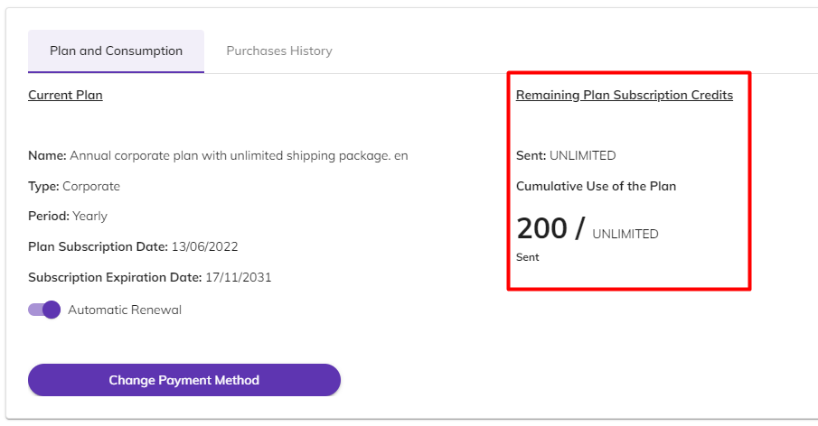
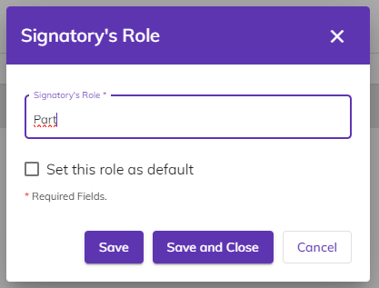
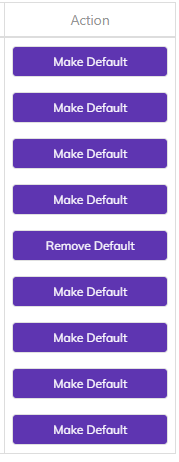
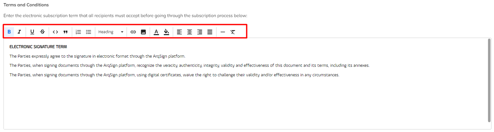
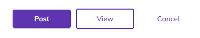

# 🟪 Account

In the Account menu, you can find information about the user's account.

<figure><figcaption>
Click on the image to enlarge.
</figcaption></figure>

***

## Invoice Data Tab&#x20;

In the Invoice Data tab, the fiscal and financial details of the user are displayed. The data provided when creating an account and purchasing a plan on the ArqSign platform is presented on this screen.&#x20;

If the user's account is on a free plan, the information will be blank but can be edited by clicking on the "Edit" button.&#x20;

<figure><figcaption>
Click on the image to enlarge.
</figcaption></figure>

In this tab, the following user information is presented:&#x20;

* **Account Name:** The name created for the account during registration on the platform. It could be, for example, the user's name or the name of the company that owns the account.&#x20;
* **Segment:** The professional segment in which the user or company operates.&#x20;
* **Number of Employees:** The number of employees in the user's company.&#x20;
* **Registration Type:** The type of registration for the account, which can be CPF (Brazilian ID), CNPJ (Brazilian company registration number), or others.&#x20;
* **Registration Number:** The registration number for the account, which should be filled in according to the option chosen in the "Registration Type" field.&#x20;
* **Default Language for New Users:** The language in which the platform will be presented to new users associated with the account, which can be Portuguese, English, or Spanish.&#x20;
* **Address:** The residential or commercial address of the user or company.&#x20;
* **Number:** The number of the residence or commercial property.&#x20;
* **Complement:** The complement of the address.&#x20;
* **Postal Code:** The postal code of the residential or commercial address of the user or company.&#x20;
* **Country:** The country of the user or company.&#x20;
* **State:** The state of the user or company.&#x20;
* **City:** The city of the user or company.&#x20;

<figure><figcaption>
Click on the image to enlarge.
</figcaption></figure>

***

## Billing and Usage Tab&#x20;

In the Billing and Usage tab, the user's account purchase history is presented.&#x20;

### Plan and Consumption Sub-Tab&#x20;

In the Plan and Consumption sub-tab, the type of plan, billing period (annual or monthly), plan subscription date, and subscription expiration date are displayed.&#x20;

By default, when creating an account, the "Automatic Renewal" option will be automatically enabled. To cancel this renewal, simply uncheck this option.&#x20;

<figure><figcaption>
Click on the image to enlarge.
</figcaption></figure>


<mark style="color:blue;">By keeping the automatic renewal enabled, when the plan expires, the system will automatically renew the payment using the same payment method as the previous purchase. If the option is disabled, the "Buy Now" button will be displayed, allowing the user to repurchase the same plan or choose another plan.</mark>&#x20;


To change the payment method for the plan, click on "Change Payment Method." A link will be sent to the account owner's email or phone with instructions to make this change.&#x20;

<figure><figcaption>
Click on the image to enlarge.
</figcaption></figure>

Clicking on "Plan Details" will display information about the user's current plan, such as plan type, billing period (monthly or annual), amount paid for the plan, description and quantity of items the plan provides access to, credit values, excess credits, and the plan's expiration date.

<figure><figcaption>
Click on the image to enlarge.
</figcaption></figure>

On this screen, it is also possible to view the remaining credits the user has for sending documents. In "Accumulated Plan Usage," the user can see the quantity of document sends included in the contracted plan.&#x20;

In "Remaining Credits from Plan Subscription," the credits the user still has in the subscribed plan are presented. The user can view the quantity of credits available for sending documents via WhatsApp and email, as well as security codes via SMS.&#x20;


<mark style="color:orange;">**It is not possible to send documents via SMS. The credits purchased for SMS sending can only be used for sending security codes. The security code or token is a password used to access documents sent via email or WhatsApp and can be used to add an extra layer of security to the electronic document signing process.**</mark>


If the user has purchased additional credits beyond those already included in the plan, clicking on "Expiration Dates of Extra Credits" will allow them to view the dates on which separately purchased credits will expire.&#x20;

<figure><figcaption>
Click on the image to enlarge.
</figcaption></figure>

***

### Purchase History Sub-Tab&#x20;

In the Purchase History tab, the user can find a description of the products already purchased, the validity period of each, the number of installments in which the payment was divided, the amount, and the status of these installments.&#x20;

Clicking on "Plan Details" displays a detailed description and quantity of the items included in the plan, credit values, excess credit values (if purchased), and the expiration date of each item.

<figure><figcaption>
Click on the image to enlarge.
</figcaption></figure>

<figure><figcaption>
Click on the image to enlarge.
</figcaption></figure>

***

## Settings Tab

### Documents Sub-Tab&#x20;

By default, the settings on this tab are automatically filled in, but it is possible to modify them by clicking the "Edit" button.&#x20;

<figure><figcaption>
Click on the image to enlarge.
</figcaption></figure>

The values set here will be adopted as the default for the configuration of sending and renewing documents and signature processes performed by the user. However, these settings can be altered for each document during its creation in the "New Document > Add Documents and Recipients > Advanced Settings" screen.

**Default expiration time of \_\_\_\_ days for the document when not signed by one or more recipients from the date of sending:** In this field, the default time (in days) is set for users to sign a document before it expires and becomes unavailable.

**Default notice period of \_\_\_\_ days before the expiration date:** In this field, it is defined how many days before a document expires recipients who have not yet signed the document should be notified about its expiration.

**Default setting for recurring reminders to be sent to recipients after the date of sending:** By checking this option, from the moment the document is sent until its expiration date, reminders will be sent to recipients at regular intervals determined in the field "Default time of \_\_\_\_\_ days for recurring reminder to recipients about any pending action on the document." If the option is disabled, the field below will also be automatically disabled.

<figure><figcaption>
Click on the image to enlarge.
</figcaption></figure>

**Generate QR Code for document access in the Signature Log:** If this option is enabled, the Signature Log of a signed document will display a QR Code through which the person accessing it can view the signed document.

**Default expiration time of \_\_\_\_\_ days for the access link to the document after the completion of the signature:** In this field, the default time (in days) is set for users to access a document after the signature process is completed until it expires and becomes unavailable.&#x20;

**Attach a file smaller than 10MB to the email sent upon signature completion:** If this option is selected, any completed document with a process file size smaller than 10MB will be sent to recipients as an attachment in the email notification of the signature completion process.&#x20;


<mark style="color:orange;">**Upon completing the signature process, the system will send an access link to the document in the body of the email to all recipients.**</mark>&#x20;


<figure><figcaption>
Click on the image to enlarge.
</figcaption></figure>

**Default setting for recurring reminders to be sent to senders after the scheduled renewal date of a document:** If this option is checked, when there is a completed document with a scheduled renewal, the system will remind the sender that it is eligible for renewal. This reminder will be sent at the interval defined in the field "Default time of \_\_\_\_ days for recurring reminders to senders about document renewal." If this option is disabled, this field will also be automatically disabled.

<figure><figcaption>
Click on the image to enlarge.
</figcaption></figure>

***

### Signatory Role Sub-Tab&#x20;

In this tab, signatory roles are created that will be presented when registering a document for signature in the "New Document > Add Documents and Recipients > Add Documents > Recipients" screen.&#x20;


<mark style="color:blue;">The signatory's role is their function in the contract, whether as a party, hired person, contractor, guarantor, witness, legal representative, etc.</mark>&#x20;


By default, the platform presents the roles "Hired," "Contractor," "Guarantor," "Party," and "Witness."&#x20;

<figure><figcaption>
Click on the image to enlarge.
</figcaption></figure>

To edit these roles, simply select the one you want and click on the "Edit" icon.

<figure><figcaption>
Click on the image to enlarge.
</figcaption></figure>

It will be possible to change the name of the role and set it as the default role.&#x20;


<mark style="color:orange;">**The default role is the one that will be assigned to the signer if the sender of the document does not define a specific role for them at the time of document registration. By default, the system assigns the "Party" role as the default, but this choice can be changed by the sender user. It is not mandatory to determine a default role, but if necessary, only one of the roles can be set as the default.**</mark>


To create a new role, click on the "Add" icon and provide a name for the role. If you wish to make it the default role, check the option "Set this role as default." To finish, click on "Save."

<figure><figcaption>
Click on the image to enlarge.
</figcaption></figure>

<figure><figcaption>
Click on the image to enlarge.
</figcaption></figure>

To change the default role, click on "Remove Default" or "Set as Default," depending on your needs.

<figure><figcaption>
Click on the image to enlarge.
</figcaption></figure>

To delete a role, click on the "Delete" icon. It's also possible to find a role type using the search bar on the screen.

<figure><figcaption>
Click on the image to enlarge.
</figcaption></figure>

***

### Notification Sub-Tab&#x20;

**Notify upon reaching \_\_\_\_% usage of my subscription items:** By filling in this field, the user will be notified by the system when their plan consumption reaches a certain percentage. This configuration will be disabled for plans with unlimited usage.&#x20;

**Notify every \_\_\_\_\_ days, starting from \_\_\_\_\_ days before the subscription expiration:** By filling in these fields, global administrators of the account will be notified within the specified period as the plan expiration date approaches.&#x20;

<figure><figcaption>
Click on the image to enlarge.
</figcaption></figure>

If the "**Custom Notifications - Customization with brand colors and logo**" field is enabled, it will be possible to insert a banner and define the highlight colors of the notifications sent to recipients via email and WhatsApp.

<figure><figcaption>
Click on the image to enlarge.
</figcaption></figure>


<mark style="color:orange;">**Pay attention to the standard dimensions of the banner image. Images outside the specified sizes will not be accepted.**</mark>


Clicking on the "Delete Image" icon will delete the banner.&#x20;

Clicking on "View Notification" will allow you to see how the notification email and WhatsApp notification will be presented to the recipient.&#x20;


<mark style="color:orange;">**If these fields are not filled in, the system will send the banner and use the default colors of the ArqSign platform.**</mark>


<figure><figcaption>
Click on the image to enlarge.
</figcaption></figure>

<figure><figcaption>
Click on the image to enlarge.
</figcaption></figure>

***

## Acceptance Term Tab&#x20;

### Sub-Tab Term&#x20;

In this tab, the user can insert or edit the Electronic Signature Term presented to signatories when signing a document. The purpose of this term is to ensure that signatories understand the legal validity of electronic signatures made through the ArqSign platform.&#x20;

The platform presents the default term, but if the user wishes to edit or replace this text, they can do so by clicking on "Edit."&#x20;

<figure><figcaption>
Click on the image to enlarge.
</figcaption></figure>

They can also change the formatting and colors of the text using the editing toolbar.&#x20;

<figure><figcaption>
Click on the image to enlarge.
</figcaption></figure>

By clicking "Preview," the Term is displayed as it will be presented to signatories.

<figure><figcaption>
Click on the image to enlarge.
</figcaption></figure>

***

### Acceptance History Sub-Tab&#x20;

In this tab, all acceptances of the Electronic Signature Term by signatories are presented. In other words, every time a signatory accepts the presented Acceptance Term, this action will be displayed on this screen.&#x20;

* **Acceptance Date:** This column displays the date on which the signatory accepted the Electronic Signature Term.&#x20;
* **Name:** The name of the signatory who accepted the term.&#x20;
* **Email/Phone:** The contact information of the signatory through which they received the link to access the document for signature and accepted the term.&#x20;
* **Term Version:** This column shows the version of the Electronic Signature Term accepted by the user. Each time the term is edited or replaced, the system assigns a new version.&#x20;
* **IP:** This column shows the IP address of the machine used by the signatory at the time of accepting the Electronic Signature Term.&#x20;
* **Geolocation:** This column shows the geolocation of the signatory's machine at the time they accepted the Electronic Signature Term.&#x20;
* **View Term:** Clicking on this button displays the version of the term accepted by the signatory.&#x20;

<figure><figcaption>
Click on the image to enlarge.
</figcaption></figure>

<figure><figcaption>
Click on the image to enlarge.
</figcaption></figure>
