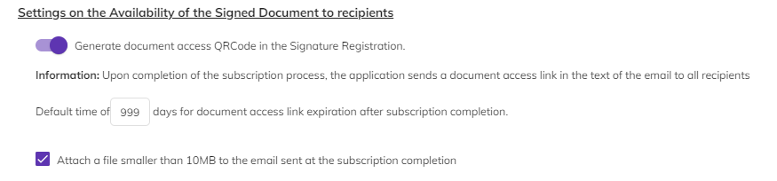
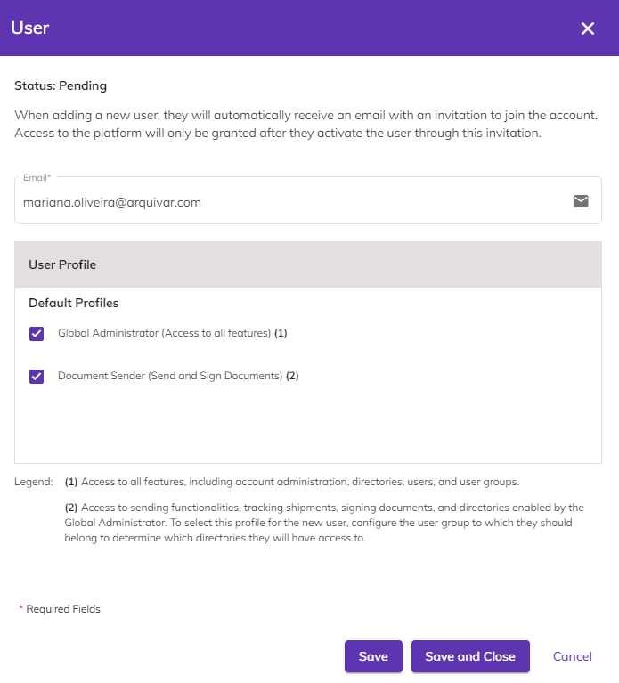
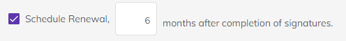
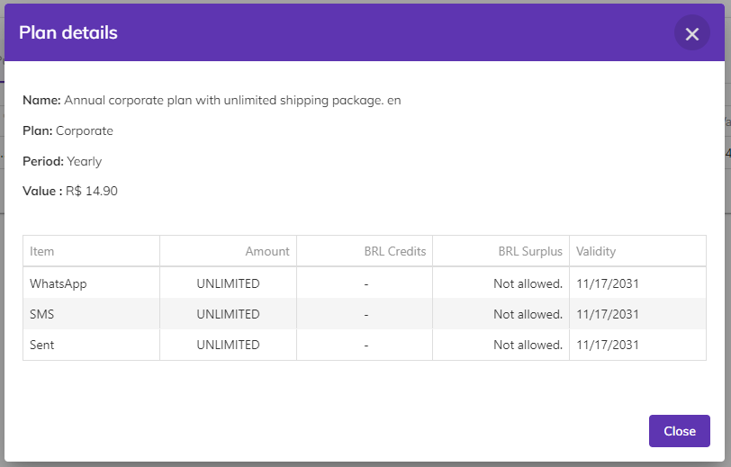
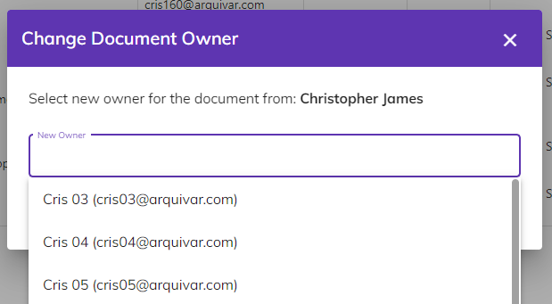
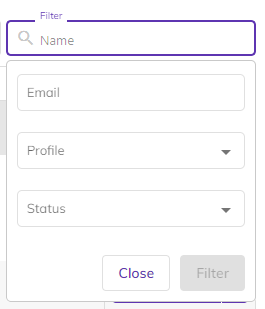

# 🟪 Users

In the Users menu, all users associated with the logged-in account are displayed.

Global administrators can invite others to join the account and perform actions on the platform.

The number of users that can be invited depends on the subscribed plan. In the free plan, only one user is allowed to access the account.

In paid plans, an unlimited number of users can be created.

<figure><figcaption></figcaption></figure>

After a new user is added by the Global Administrator, the invited user receives an email with the invitation to join the account. If the user is already registered on the platform, they only need to provide their password. If they are not yet registered, they must enter their name and create a password to complete the first login.

<figure><figcaption>
Click on the image to enlarge.
</figcaption></figure>

<figure><figcaption></figcaption></figure>

<figure><figcaption></figcaption></figure>

***

## Columns on the Main Screen – Users&#x20;

<figure><figcaption></figcaption></figure>

**E-mail:** Displays the email addresses of users associated with or invited to the account.

**Nome:** Shows the names of users. For users with "Pending" status, the name is not displayed because they have not yet completed their registration on the platform.

**Data Cadastro:** Displays the date and time when the user was registered in the account.

**Perfis:** Shows the profiles assigned to the user, which can be Global Administrator (access to all functionalities) and Document Sender (sends and signs documents). A user can have both profiles.

**Status:** Displays the user's status, which can be "Active" (already registered in the account), "Pending" (has not yet accepted the invitation to join the account), "Blocked," or "Inactive" (the user is no longer part of the account).


<mark style="color:blue;">**DIFFERENCE BETWEEN BLOCKED AND INACTIVE USER:**</mark>

<mark style="color:blue;">**Blocked:**</mark> <mark style="color:blue;"></mark><mark style="color:blue;">When a user is blocked, their access to the account is restricted. The documents that are their responsibility remain with them, and when unblocked, the user will regain access to those documents as usual. This feature is useful in cases of temporary employee absence, for example.</mark>

<mark style="color:blue;">**Inactive:**</mark> <mark style="color:blue;"></mark><mark style="color:blue;">When a user is deactivated, their access to the account is also blocked. The documents that are their responsibility may either remain with them or be transferred to another owner. If the user is reactivated and the documents have been transferred, they will lose access to the files. If the documents have not been transferred, the user will continue to have access to them as usual. This feature is useful for situations such as an employee's departure, for example.</mark>


***

## Actions on the Users Screen&#x20;

The actions on the Users screen can be accessed through the top buttons, the actions column on the right, or by clicking on any user information in the grid on the main screen..png>).png>)

**New:** To invite a new user to join the account, click on "New." By default, the user will have "Pending" status until they accept the invitation to join the account.

The user must enter the email address and define the profile to be assigned to the user, which can be Global Administrator (access to all functionalities), Document Sender (sends and signs documents), or both.

<figure><figcaption>
Click on the image to enlarge.
</figcaption></figure>

If the invited user has only the Document Sender profile, it will also be necessary to define the User Group to which the invited user will be associated. This user group determines which folders in the directory the new account member will have access to and must have been previously created in the [Administration > User Group](user-groups.md) menu. It is also possible to create a group by clicking on "New Group."

<figure><figcaption>
Click on the image to enlarge.
</figcaption></figure>


<mark style="color:orange;">**The group definition is not required for users created with the Global Administrator profile because these users have access to all Document Folders in the Directory, so no restriction is necessary.**</mark>


**Activate:** Only users with "Blocked" or "Inactive" status can be activated. By activating blocked or inactive users, they will regain access to the account.

<figure><figcaption></figcaption></figure>

**Block:** Only users with "Active" status can be blocked. Blocked users lose ownership of all documents.

<figure><figcaption></figcaption></figure>

**Edit:** Used to edit the user's information.

**Inactivate:** Only users with "Active" status can be inactivated. When inactivating a user, it will be necessary to decide whether the documents sent by the user being inactivated will be transferred to another account member or if the inactivation will proceed without transfer.

If the "Inactivate without Transfer" option is chosen, the user, although inactive, will remain the owner of the documents.

<figure><figcaption>
Click on the image to enlarge.
</figcaption></figure>

If the "Transfer" option is chosen, it will be necessary to specify who the new owner of the documents will be and whether all documents will be transferred or only those that are in the signing process or have a scheduled renewal.

<figure><figcaption></figcaption></figure>

**Delete:** Users with "Pending" status, meaning those who were invited but have not yet joined the account, can only be deleted.

<figure><figcaption>
Click on the image to enlarge.
</figcaption></figure>

**Filter:** It is possible to search for a user using the filters available in the top search bar.

<figure><figcaption>
Click on the image to enlarge.
</figcaption></figure>
