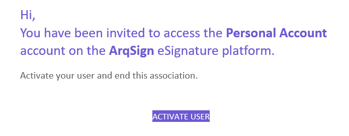
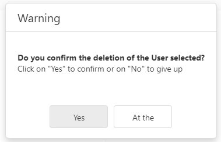
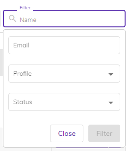

# 🟪 Users

In the Users menu, all users participating in the logged-in user's account are displayed.

Global administrators can invite other individuals to join the account and perform actions on the platform.

The number of users that can be invited varies depending on the contracted plan. In the free plan, only one user can access the account.

In the free plans, as many users as necessary can be created (unlimited).

<figure><figcaption>
Click on the image to enlarge.
</figcaption></figure>

After a new user is added by the Global Administrator, the invitee receives an email invitation to join the account. If they already have an account on the platform, they only need to provide their password. If they don't have an account yet, they need to provide their name and create a password to access the platform for the first time.

<figure><figcaption>
Click on the image to enlarge.
</figcaption></figure>

***

## Columns on the Main Screen – Users&#x20;

**Email:** Displays the email addresses of associated or invited users for the account.&#x20;

**Name:** Presents the names of users. For users with a "Pending" status, the name is not displayed because they have not yet registered on the platform.&#x20;

**Registration Date:** Shows the date and time when the user was registered on the account.&#x20;

**Profiles:** Displays the profiles assigned to the user, which can be Global Administrator (access to all features) and Document Sender (sends and signs documents). The same user can have both profiles.&#x20;

**Status:** Presents the user's status, which can be "Active" (already registered in the account), "Pending" (has not accepted the invitation to join the account yet), or "Blocked" (a user who is no longer part of the account).&#x20;


<mark style="color:blue;">**DIFFERENCE BETWEEN BLOCKED AND INACTIVE USER:**</mark>

<mark style="color:blue;">When a</mark> <mark style="color:blue;"></mark><mark style="color:blue;">**user is blocked,**</mark> <mark style="color:blue;"></mark><mark style="color:blue;">their access to the account is prevented. The documents that are under their responsibility remain with them, and when they are unblocked, the user will continue to have normal access to them. This functionality is useful in cases of temporary absence of an employee, for example.</mark>

<mark style="color:blue;">When a</mark> <mark style="color:blue;"></mark><mark style="color:blue;">**user is inactivated,**</mark> <mark style="color:blue;"></mark><mark style="color:blue;">their access to the account is prevented, and the documents that are under their responsibility may remain with them or be transferred to another owner. If this user is activated again and the documents have been transferred, they will lose access to the files. If they have not been transferred, they will continue to have normal access to them. This functionality is useful in cases of employee termination, for example.</mark>


***

## Actions on the Users Screen&#x20;

The actions on the Users screen can be accessed through the top buttons, the actions column on the right, or by clicking on any user information in the main screen grid.&#x20;

<figure><figcaption>
Click on the image to enlarge.
</figcaption></figure>

 

<figure><figcaption>
Click on the image to enlarge.
</figcaption></figure>

**New:** To invite a new user to join the account, click on "New." By default, the user will have a "Pending" status until they accept the invitation to join the account.&#x20;

The user must set a security code that the invitee will need to enter for the initial account access. Afterward, provide the user's email and choose the type of profile to be assigned, which can be Global Administrator (access to all features), Document Sender (sends and signs documents), or both.&#x20;

<figure><figcaption>
Click on the image to enlarge.
</figcaption></figure>

If the invited user has only the Document Sender profile, it is necessary to define the User Group to which the invitee will be associated. This user group will determine which folders in the directory the new account member will have access to and should have been previously created in the Administration > User Group menu. It is also possible to create a group by clicking on "New Group."&#x20;

<figure><figcaption>
Click on the image to enlarge.
</figcaption></figure>


<mark style="color:orange;">**The group definition is not required for users created with a Global Administrator profile because these users have access to all folders in the Directory Documents, eliminating the need for this restriction.**</mark>&#x20;


**Activate:** Users with "Blocked" or "Inactive" status can be activated. When activated, previously blocked or inactive users regain access to the account.&#x20;

**Block:** Only users with "Active" status can be blocked. Blocked users lose ownership of all documents.&#x20;

<figure><figcaption>
Click on the image to enlarge.
</figcaption></figure>

**Edit:** Used to edit user information.&#x20;

**Deactivate:** Users with "Active" status can be deactivated. When deactivating a user, it is necessary to decide whether the documents sent by that user will be transferred to another account member or if deactivation will occur without transfer.&#x20;

If the "Deactivate without Transfer" option is chosen, the user, despite being inactive, will remain the owner of the documents.&#x20;

If the "Transfer" option is chosen, it is necessary to inform who will be the new owner of the documents and whether all documents or only those in the signing process or with scheduled renewals will be transferred.&#x20;

<figure><figcaption>
Click on the image to enlarge.
</figcaption></figure>

**Delete:** Only users with "Pending" status, i.e., those who have been invited but have not yet joined the account, can be deleted from the account.&#x20;

<figure><figcaption>
Click on the image to enlarge.
</figcaption></figure>

**Search:** It is possible to search for a user in the account by name or email using the top search bar.&#x20;

<figure><figcaption>
Click on the image to enlarge.
</figcaption></figure>
