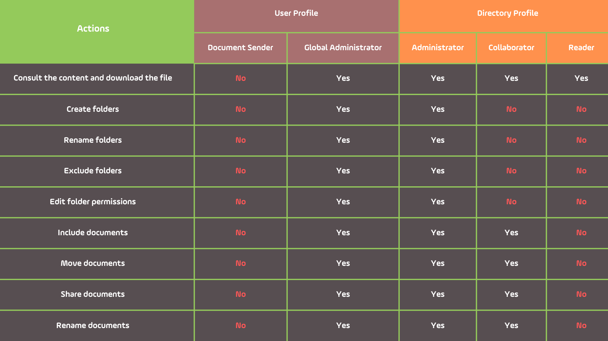

# 🟪 Directory configuration for clients who have not yet signed documents

## Directory Structure Creation

### STEP 1 - Directory Structuring&#x20;

1\. Identify which departments will use the ArqSign Platform for sending documents for signature. Create a folder for each department accordingly. To do this, access the root folder on the Documents screen and click on the "Include Folder" icon.&#x20;

<figure><figcaption>
Click on the image to enlarge.
</figcaption></figure>

2\. Enter the department name and click Save.

<figure><figcaption>
Click on the image to enlarge.
</figcaption></figure>

3. Repeat the process until you have created all the necessary folders.

<figure><figcaption>
Click on the image to enlarge.
</figcaption></figure>


<mark style="color:orange;">**The Global Administrator must perform all configurations, permission adjustments, user clearance, etc., before initiating the document sending process for signatures.**</mark>


***

### STEP 2 - Creation of Groups by Departments or Functions&#x20;

Create user groups by separating them by departments, roles, or a combination of both. To do this, access the Administration screen > User Groups.&#x20;


<mark style="color:blue;">These groups will be used to assign permissions to folders, so the way you create them will depend on how you want to assign permissions to the folders. Our suggestion is to merge the department and the role, for example:</mark>&#x20;

* <mark style="color:blue;">Commercial – Management</mark>&#x20;
* <mark style="color:blue;">Commercial – Sales Representatives</mark>&#x20;
* <mark style="color:blue;">Commercial - Other roles with read-only access</mark>&#x20;


<figure><figcaption>
Click on the image to enlarge.
</figcaption></figure>

***

### STEP 3 - Insertion of the Created Groups in the Root Folder&#x20;

The groups created in the previous step must be inserted into the root directory with "Reader" permission. To do this, in the root folder, click on Actions > Edit Authorizations.&#x20;

<figure><figcaption>
Click on the image to enlarge.
</figcaption></figure>

Click on the "Include" icon.&#x20;

<figure><figcaption>
Click on the image to enlarge.
</figcaption></figure>

Select each of the groups created in the previous step, and in the "Profile" column, assign the "Document Reader" profile to all groups. Click the "Confirm" icon to save the changes.&#x20;

<figure><figcaption>
Click on the image to enlarge.
</figcaption></figure>

***

### STEP 4 - Adjustment of Sectorial Folder Permissions&#x20;

Permissions for sectorial folders must be adjusted to allow access only to individuals from the respective department, and for this, the following steps are necessary:&#x20;

**1. Stop inheriting permissions from the root folder:** In the "Actions" column of the desired sectorial folder, click on "Edit Authorizations." Click on "Stop Inheriting."&#x20;

<figure><figcaption>
Click on the image to enlarge.
</figcaption></figure>

<figure><figcaption>
Click on the image to enlarge.
</figcaption></figure>

**2. Exclude groups from other departments:** Select all other groups/departments that should not have access to the content of the selected folder and click on the "Delete" icon. Only the groups that should have access to the folder should remain.&#x20;

<figure><figcaption>
Click on the image to enlarge.
</figcaption></figure>

**3. Edit the access profile for the specific department:** Adjust permissions for the remaining groups by selecting them and clicking on the "Edit" icon.&#x20;

<figure><figcaption>
Click on the image to enlarge.
</figcaption></figure>

**4. In the "Profile" column:** Define whether the group will remain only as a "Document Reader" or if it will be an "Document and Folder Administrator" or "Document Collaborator."&#x20;

* _Document and Folder Administrator:_ A user or group of users with this directory profile can view and download content, add, move, share, and rename documents, delete or include new folders, as well as change access permissions.
* _Document Contributor:_ A user or group of users with this directory profile can view and download content, add, move, share, and rename documents within the folder to which they have this profile.
* _Document Reader:_ A user or group of users with this directory profile can only view and download the content of the folder and documents.

<figure><figcaption>
Click on the image to enlarge.
</figcaption></figure>


<mark style="color:orange;">**This process must be repeated for all other sectorial folders and subfolders that may be created within the departmental folders.**</mark>


***

## Permissions for Directories&#x20;

Only the Global Administrator of the account will have access to the directory menu, and for this reason, it is crucial to ensure that only individuals without access restrictions hold this profile. Below are the differences between the permissions granted to each profile:&#x20;

<figure><figcaption>
Click on the image to enlarge.
</figcaption></figure>


<mark style="color:orange;">**All users must be associated with a permission group. This way, the platform should prompt the user to save the document in a sectorial folder, preventing documents from being stored in the root folder.**</mark>&#x20;


***

## Creation/Maintenance of Permissions per User&#x20;

Once the directory structure has been created and permissions applied, maintenance on the platform boils down to including or excluding users from groups to grant or revoke access to specific folders.&#x20;

This maintenance can be performed either in the user's profile edit or in the edit of a specific group.&#x20;

_Editing a specific group:_ Access the Administration screen > User Groups. Select the desired group and include or exclude users.&#x20;

_User profile edit:_ Access the Administration screen > Users. Select the user you wish to edit and click on "Edit." Define the groups the user should have access to and click "Save."&#x20;

***

## General Directory Rules

Folders

1. Every account, upon creation, automatically has an associated root folder.
2. The root folder automatically created by the platform is named after the account and can be renamed later by its Global Administrator.
3. Each account is allowed only one root folder. All other folders must be created within the root folder.
4. Documents displayed in "Directories" are only those with the status "Completed" and are not "Deleted". In other words, if a document is in the signing process, it will not appear in the directory.

User Profiles

1. The Global Administrator user profile has full access to the document directory if the account plan includes access to directory functionality.
2. The Document Sender user profile will have access to navigate folders if they are part of a group that has at least read permissions.

