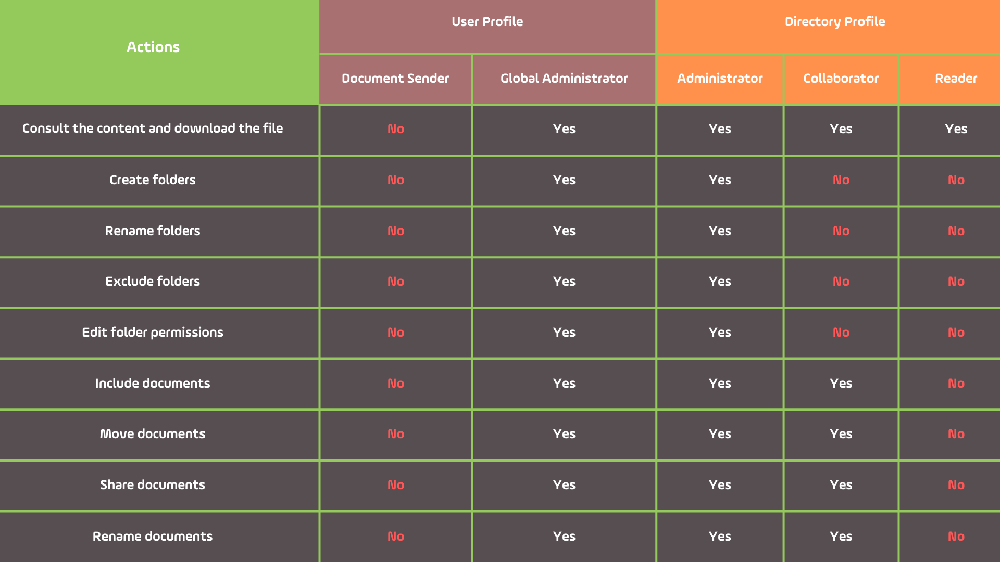

# 🟪 Directory configuration for clients who have not yet signed documents

## Directory Structure Creation

### STEP 1 - Directory Structuring&#x20;

1\. Identify which departments will use the ArqSign Platform for sending documents for signature. Based on these departments, create a folder for each one. To do this, go to the [Documents](./) screen, access the root folder, and click on the "Include Folder" icon.

<figure><figcaption></figcaption></figure>

2\. Enter the department name and click Save.

<figure><figcaption></figcaption></figure>

3.  Repeat the process until all necessary folders are created.

    <figure><figcaption></figcaption></figure>


<mark style="color:orange;">**The Global Administrator must perform all configurations, permission adjustments, user releases, etc., before starting to send documents for signing.**</mark>


***

### STEP 2 - Creation of Groups by Departments or Functions&#x20;

Create user groups by separating them by sectors, functions, or a combination of both. To do this, go to the[ Administration > User Groups](../../administration/administration/user-groups.md) screen.


<mark style="color:blue;">These groups will be used to assign permissions to folders, so the way you create them will depend on how you want to assign permissions to the folders. Our suggestion is to mix sector and function, such as:</mark>

* <mark style="color:blue;">Commercial – Management</mark>
* <mark style="color:blue;">Commercial – Salespeople</mark>
* <mark style="color:blue;">Commercial - Other functions with read-only access</mark>


<figure><figcaption></figcaption></figure>

***

### STEP 3 - Insertion of the Created Groups in the Root Folder&#x20;

The groups created in the previous step must be inserted into [the root directory](./#root-folder-of-directories) with "Reader" permission. To do this, in the root folder, click on Actions > Edit Authorizations.&#x20;

<figure><figcaption></figcaption></figure>

Click on the "Include" icon.&#x20;

<figure><figcaption></figcaption></figure>

Select each of the groups created in the previous step and in the "Profile" column, assign the "Document Reader" profile to all the groups. Click on the "Confirm" icon to save the changes.

<figure><figcaption></figcaption></figure>

***

### STEP 4 - Adjustment of Sectorial Folder Permissions&#x20;

The permissions for the sector folders must be adjusted so that access is granted only to members of the sector. To do this, it will be necessary to:

1.  **Stop inheriting permissions from the root folder:** In the "Actions" column of the desired sector folder, click on "Edit Permissions". Then, click on "Stop Inheriting".

    <figure><figcaption></figcaption></figure>

<figure><figcaption></figcaption></figure>

2. **Remove groups from other sectors:** Select all the other groups/sectors that should not have access to the content of the selected folder and click on the "Delete" icon.&#x20;

Only the groups that should have access to the folder should remain.

<figure><figcaption></figcaption></figure>

**3. Edit the access profile of the relevant sector:** Adjust the permissions of the remaining groups by selecting them and clicking on the "Edit" icon.

<figure><figcaption></figcaption></figure>

**4. In the "Profile" column:** Define whether the group will remain only as "Document Reader" or if it will be "Document and Folder Administrator" or "Document Collaborator."

* _Document and Folder Administrator:_ A user or group with this directory profile can view and download content, add, move, share, and rename documents, delete or create new folders, and change access permissions.
* _Document Collaborator:_ A user or group with this directory profile can view and download content, add, move, share, and rename documents within the folder to which they have access.
* _Document Reader:_ A user or group with this directory profile can only view and download the content of the folder and documents.

<figure><figcaption></figcaption></figure>


<mark style="color:orange;">**This process should be repeated for all other sectoral folders and subfolders that can be created within the sector folders.**</mark>


***

## Permissions for Directories&#x20;

Only the Global Administrator of the account will have access to the directory menu, which is why it is crucial to ensure that only users with no access restrictions are assigned this profile. Below are the differences in the permissions granted to each profile:

<figure><figcaption>
Click on the image to enlarge.
</figcaption></figure>


<mark style="color:orange;">**All users must be associated with a permission group. Thus, the platform should require the user to save the document in a sectoral folder, preventing documents from being stored in the root folder.**</mark>


***

## Creation/Maintenance of Permissions by User&#x20;

Once the directory structure is created and permissions are applied, platform maintenance consists of adding or removing users from groups so they can access or be restricted from accessing specific folders.

This maintenance can be done in the user’s edit or a specific group’s edit.

**Editing a specific group:** Access the screen [Administration > User Groups](../../administration/administration/user-groups.md). Select the desired group and add or remove users.

**Editing a user:** Access the screen [Administration > Users](../../administration/administration/users.md). Select the user you want to edit and click “Edit”. Define the groups the user should have access to and click “Save”.

***

## General Directory Rules

Folders

1. Every account, upon creation, will automatically have an associated root folder.
2. The root folder created automatically by the platform is named after the account and can be renamed later by its Global Administrator.
3.  Each account is allowed only one root folder. Additional folders must be created within the root folder.

    &#x20;
4.  Documents displayed in "Directories" are only those with the status "Completed" and that are not "Deleted." In other words, if a document is in the signing process, it will not appear in the directory.

    .&#x20;

User Profiles

1. The **Global Administrator** user profile has full access to the document directory, provided that the account plan includes access to the directory functionality.ty.&#x20;
2. The **Document Sender** user profile has access to navigate through the folders if they are part of a group that has at least read permission.s.&#x20;

