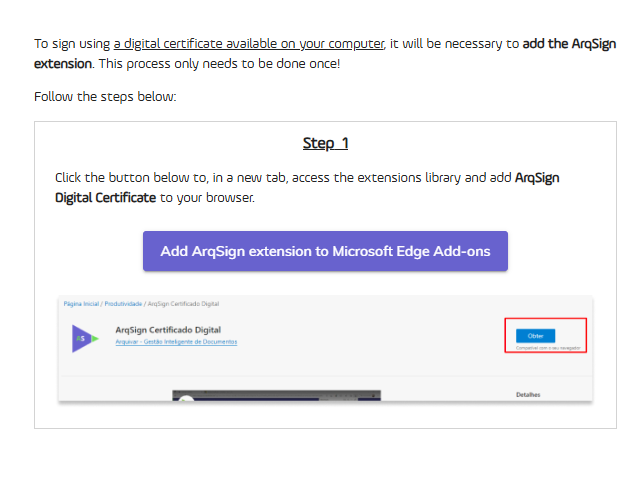

# 🟪 How to Use

Finding a document on the ArqSign Platform is easy and efficient. Just follow the instructions below:

First, navigate to the Inbox where the document is located. All inboxes (Inbox, Sent, Drafts, Deleted, Renewals) include a search feature labeled “Filter.”

Click on the “Filter” field.

The search options will be displayed.

Enter relevant information in the desired fields, such as the signer’s name, status, document folder, or completion date.

Click “Filter.”

All documents that match the entered criteria will be displayed.

To clear the filter, simply click the “X” in the right corner of the “Filter” field.

See how simple it is? Now you can quickly and efficiently locate your documents on the ArqSign Platform! Discover how easy and practical ArqSign is for signing your documents. With just a few clicks, you can complete tasks that were once time-consuming and often bureaucratic.

Discover the ArqSign platform

**Getting to Know the Platform**

Access the Signature platform and configure your Electronic Signature.

On the left side of the screen, you will find all available menus, organized into groups: Mailbox, Directories, and Administration. It is important to note that these menus will be displayed according to each user's permission level. Click on the image to enlarge.

.png>)

**MAILBOX:** This group contains menus related to the document processing workflow. Click on the image to enlarge.

.png>)

**DIRECTORIES:** This group contains the Documents menu, which serves as a storage repository for documents processed by the platform. In other words, all documents with a completed signature process can be found here. Click on the image to enlarge.

.png>)

**ADMINISTRATION:** This group contains settings related to the account, users, and user groups.

.png>)

Signing a document using your cell phone

1. The batch signing process can also be performed directly via mobile phone, following the same steps as on the platform.
2. The "Batch Signature" option will appear, along with the list of documents pending signature for selection. Once the documents are selected, click on the "Batch Signature" icon.

.png>)

3. Fill in the requested data.

.png>)

4. Define the visual representation (Signature Style).

.png>)

5. Track the progress of the signatures.

.png>)

6. A notification of the completed process will be displayed.

.png>)

7. Once the signature process is completed by all responsible parties, the final document can be accessed in ArqGED, as it will be retained in the workflow.

How to sign documents on the ArqSign platform?

If you have received a document for signature, click on the access link to the document provided in the message you received, or if you have an ArqSign account, you can access the document through your Inbox by clicking on "Sign."

1. The document will be displayed for reading.
2. After reading, click on "Sign."
3. If prompted, fill in your details such as Name and document.
4. If prompted, attach a document.
5. Apply the visual representation of your signature using one of the signature styles: Standard (your name written), Drawing (handwritten signature), or Image (upload the image/photo of your signature).
6. Click on "Complete."

[Click here to see how to sign documents through the ArqSign ](../top-menu/document-signing.md)[platform.](../top-menu/document-signing.md)

How to sign documents in batch?

[Click here to check how to perform batch document signing through the ArqSign platform.](../top-menu/batch-signing.md)

How to configure profile?

1. Access the Signature platform and configure your Electronic Signature.
2. After logging in, click on your name in the upper right corner.
3. Click on "My Profile."

.png>)

**Tab "My Data"**

1. Make sure your data is fully updated. If you want to change something, click on "Edit" to enable the editing fields.

.png>)

**Tab "My Contacts"**

In this tab, you can maintain a list of the most frequently used contacts on the platform.

1. In this tab, you can "Save the recipients of a document sent for signature in my contact list."
2. By clicking on the "+" icon, you can add contacts. When you click this option, a screen will be enabled for registering a new contact to include in the list. After entering the contact's details, click "Save" or "Save and Close."

.png>)

**Icons – "My Contacts" Tab**

.png>)

**"Signature Style" Tab**

1. In this tab, register the signatures you will use in document signing processes. Click on "Edit" to enable the fields.
2. Go through the three available options. After completing, click "Save."

.png>)

"**Digital Certificate" Tab**

1. In this tab, you can upload digital certificates to the cloud, storing them on the ArqSign Platform. These stored certificates will be listed when the logged-in user is signing a document with the Digital Certificate (ICP) signature type.

.png>)

**"Requests" Tab**

1. In the "Requests" tab, the user can view requests for document ownership transfer. For example, if the user changes the document owner in the inbox, the movement will be recorded in the "Requests" tab.

.png>)

How to enable/disable QRCode generation in the Signature Record for accessing the signed document?

To standardize the QRCode generation configuration in the Signature Record for an account, you must be a user with the Global Administrator or Account Administrator profile and follow these steps:

* Go to: Administration > Account > Settings > Documents;
* Click "Edit";
* In "Settings for Availability of the Signed Document to Recipients," enable or disable the QRCode generation in the Signature Record as per your preference;
* Click Save.

This change will apply to the account.

If necessary, a user with any profile can modify the default configuration of this functionality for a specific workflow. To do so, follow these steps:

* Click "New Document";
* Upload a new document;
* Click "Advanced Settings";
* Enable or disable the QRCode generation for document access in the Signature Record;
* Click "Apply".

How to share a saved contact in the ArqSign platform with other users of the account?

In the "My Profile" menu, under the "My Contacts" option, select the contact.

The system will display the registration data in view mode, along with the corresponding action buttons according to the permissions of the logged-in user.

The available action options will be:

\_ For contacts of the logged-in user in the active account: New, Edit, and Cancel.

\_ For contacts shared by other active users in the logged-in account: New and Cancel.

To share a contact, choose the "Edit" option, check the sharing option, and click Save.

In the "My Profile" menu, under the "My Contacts" option, select the contact.

The system will display the registration data in view mode, along with the corresponding action buttons according to the permissions of the logged-in user.

The available action options will be:

\_ For contacts of the logged-in user in the active account: New, Edit, and Cancel.

\_ For contacts shared by other active users in the logged-in account: New and Cancel.

To delete a contact, choose the "Delete" option and confirm the deletion.

How to edit a saved contact in the ArqSign platform?

The system will display the registration data in view mode, along with the corresponding action buttons according to the permissions of the logged-in user.

The available action options will be:

\_ For contacts of the logged-in user in the active account: New, Edit, and Cancel.

\_ For contacts shared by other active users in the logged-in account: New and Cancel.

To edit a contact, choose the "Edit" option, make the necessary changes, and click "Save".

How to send a document for signature to a saved contact in the ArqSign platform?

To send a document for signature to a saved contact in the ArqSign Platform, whether in your user account or shared by another user, follow these steps:

1. Click on "New Document," upload the document, and perform the necessary settings related to the document.
2. In the recipient configuration section, click on the button.
3. The platform will display a query grid with all the contacts of the logged-in user associated with the logged-in account, alphabetically ordered by the name column. It will then display all the contacts from other active users in the logged-in account who have been marked for sharing with all account users, alphabetically ordered by the name column.
4. Choose the recipient(s) and click on "Add Recipients."
5. Configure the type of electronic signature for each recipient.
6. Configure the security token or private message for each recipient, if applicable, and proceed with the next steps to send the document for signature.

How do I import/How to save contacts in the ArqSign platform?

You can save contacts in the ArqSign Platform in two ways:

**First way:**

1. When registering a recipient, keep the checkbox "Save this recipient in my contact list" checked.

**Second way:**

1. Access the "My Profile" menu.
2. Access the "My Contacts" option.
3. To insert a contact, click on the "+" button, enter the details, choose whether to share the contact with all users of the account, and click Save.
4. To automatically save all recipients you send documents to for signing in the future, enable the "Save recipients of a document sent for signature in my contact list" option.
5. The Name and Email/WhatsApp of the recipient(s) will be saved as contacts of the user in the account. Contacts will be linked to the account the user is logged into. Therefore, when this user logs into another account, the contacts will be different.

**Rules:**

* It is not allowed to register a contact with the same email as an already registered contact that:
  * Belongs to the logged-in user in the account.
  * Is related to other active users of the logged-in account and shared in the account.
* Only a valid email can be registered for an email contact.
* It is not allowed to register a contact with the same phone number as an already registered contact that:
  * Belongs to the logged-in user in the account.
  * Is related to other active users of the logged-in account and shared in the account.
* Only a valid phone number can be registered for a WhatsApp contact.
* The field "Share with all users of the account" is optional, allowing the user to specify if the contact being created will be shared with other contacts in the account.

To understand better, [click here](https://www.youtube.com/watch?v=b73Cu1HCaWA) and watch the explanatory video.

How to verify the validity of a printed document signed on the ArqSign platform through the QRCode?

If you have a printed document signed through the ArqSign platform and need to verify its validity, you can check the following security items:

1. Locate a watermark with the "**Document ID**" in the top left corner of the signed pages.
2. Confirm that the "**Document ID**" is the same on all pages and in the Signature Registry.
3. Every time a document is signed through the ArqSign Platform, a file named "Signature Registry" is generated. The "Signature Registry" contains:

a) The identification of the document it belongs to, i.e., the "**Document ID**";\
b) The document's **hash** (proof of document integrity);\
c) Information about the **sender, creation and submission date**;\
d) Document **status, size, number of pages, and signatures**;\
e) **QRCode** granting **access to the document on the ArqSign platform**\*;\
f) **Link** granting **access to the document on the ArqSign platform\***;\
g) **Detailed information about all signatures, including**:\
I. Name\
II. Email\
III. Document\
IV. Security level\
V. ICP-Brasil certificate used\
VI. Date and time\
VII. Device IP\
VIII. Geolocation\
h) Audit trail followed by each participant in the signing process, detailed through the following events:\
I. Read – by which signer, date and time, IP, and Geolocation\
II. Online Signature – by which signer, date and time, IP, and Geolocation

4. If you wish to verify the legal validity of the document on the ITI or Adobe portal, access the document via the QRCode.

\*When accessing the document on the ArqSign Platform via **QRCode or link**, you can:

* Download the document and the "Signature Registry";
* Display the history (audit trail);
* Display the acceptance term for electronic signature;
* Verify the signature details.

How to search for a document on the ArqSign platform?

Finding a document on the ArqSign platform is super practical, just follow the instructions below:

First, find the inbox where the document is located. All inboxes (Inbox, Sent, Drafts, Deleted, Renewals) have a search feature labeled as "Filter".

Click on the "Filter" field.

The search options will be displayed.

Enter search information in the desired fields, such as signer name, status, document folder, or completion date.

Click "Filter".

All documents matching the entered filter criteria will be displayed.

To cancel the filter, simply click on the "X" that appears in the right corner of the "Filter" field.

See how easy it is? Now you can quickly and efficiently locate your documents on the ArqSign platform!

Customization of the ArqSign platform with the client's colors and logo

On the ArqSign platform, notifications (emails and WhatsApp messages) for senders and recipients can have the following layouts:

1. ArqSign Platform Default Layout or
2. Layout with your colors and logo.

The customizable items are:

* Header
* Text color
* Button color for email or WhatsApp message

To customize the notifications on the ArqSign platform, the Account Administrator should access: Administration > Account > Settings > Others and follow these steps:

1. In the bottom right corner, click on edit;
2. In “Custom Notifications,” change to Enabled;
3. In “Email Notifications,” complete the following steps:

* Upload an image for the email message header with the dimensions specified in the field;
* Choose the highlight color for the email text.

4. In “WhatsApp Notifications,” complete the following step:

* Upload an image for the message header with the dimensions specified in the field.

5. If you want to preview the notifications with the changes you made, click “Preview Notification”;
6. Once all adjustments are made, click “Save”.

.png>)

Standard Notification:

.png>)

Example of customized notification simulation:

.png>)

How to configure a private message:

1. Click on ‘New Document’.
2. Select the document you wish to send and provide the signatory’s details such as name, email, etc.
3. Below these details, you will see a 'message' .png>)symbol. Click on it to open the private message tab.
4. In the private message tab, you can enter the subject and the message you want to send specifically to the selected signatory. Other signatories will receive the default message.

How to configure the security token?

1. Click on ‘New Document’.
2. Select the document you want to send and enter the signatory’s information, such as name and email.
3. Below this information, there will be a 'lock' .png>)symbol. Click on it to open the security tab.
4. In the security tab, you can generate the code 'Automatically or Manually' and specify the method (email, SMS, WhatsApp, or none) through which you want to send the token.
5. Once configured, the security token will be sent through the selected method when the signatory clicks to access the document. If no method is selected, you can provide the token to the signatory directly.

How to request attachments and a selfie?

Click on ‘New Document’.

Select the document you wish to send, configure the recipients, and proceed.

Set up the signature field for the recipient.

On the right side, if desired, request additional information such as Name and ID, and enable mandatory fields if needed.

To request attachments, such as document images or a selfie, enable the option for the signatory to attach a document.

Specify the document you need the signatory to attach and indicate whether the attachment is mandatory for the completion of the signing process for that document.

You can also configure whether all signatories will have access to the attachment.

When the recipient receives the document for signing, they should:

Sign the document and fill in the requested details.

Click on the selfie request.

Access the camera on their mobile or computer.

Take the photo as requested.

Select the photo as an attachment.

Complete the signing process.

How to access document attachments?

1. Locate the document for which you want to view the attachment.
2. Double-click on the document.
3. On the right side, next to the document's signatories, you can download the attachment.

How to configure signing with a foreign document?

To configure a signature that requires a foreign document, follow these steps:

1. After uploading the document;
2. Add the recipients and click “Next”;
3. On the “Configure fields” screen, set up signature collection for the recipients;
4. Select the recipient at the top of the screen;
5. On the right side, select the signature type for Individual;
6. Just below, find the “Additional signature information” settings;
7. Check the box “Signatory’s Name”;
8. Check the box “Signatory’s Document”;
9. In the “Document” box, choose “Other”;
10. In the box below, specify the document you want to request, and if desired, configure the valid character types and the number of characters for validation in the additional boxes.

How to add a recipient in copy or as an observer in a workflow?

On the ArqSign Platform, it’s possible to add a person in copy or as an observer in a workflow. This way, at the end of the signing process, this person or persons will receive the signed document.

To set this up, proceed as follows:

1. Click on “New Document”;
2. Upload the document to be signed and configure the document settings as needed;
3. In “Recipients,” set the field “This recipient will” to “Receive a copy”;
4. Continue with the remaining configurations.

How to change the credit card for billing and purchases on the ArqSign platform?

You can update your credit card for billing and purchases on the ArqSign Platform by following these steps:

1. Go to the “Administration” menu;
2. Click on “Account”;
3. Select “Billing and Usage”;
4. Click on “Change payment method".

How to configure a document for signing with or without a digital certificate (digital or electronic signature)?

On the ArqSign platform, when setting up a signature flow, you can specify the type of signature required for each recipient, choosing from:

a) **Electronic Signature** (ArqSign provides advanced electronic signatures with legal validity per MP 2.200-2 of 08/24/2001 and Law 14.063 of 11/23/2020);

b) **Digital Signature with ICP-Brasil Certificate** (ArqSign provides qualified digital signatures per MP 2.200-2 of 08/24/2001 and Law 14.063 of 11/23/2020);

c) **Digital Signature with Any Personal Digital Certificate** (ArqSign provides electronic and digital signatures with other certificates).

To set the type of signature, follow these steps:

After uploading and setting up the document, proceed to recipient configuration;

In the "Signature Type" field for each recipient, choose one of the options above;

Done! Now configure the remaining recipients, the signature positions, and send the document.

How to sign a document with a Digital Certificate - ICP-Brasil?

On the ArqSign Platform, the document sender can specify the type of signature required from the recipient, choosing from:

a) **Electronic Signature** (ArqSign provides advanced electronic signatures with legal validity in compliance with MP 2.200-2 of 08/24/2001 and Law 14.063 of 11/23/2020);

b) **Digital Signature with ICP-Brasil Certificate** (ArqSign provides qualified digital signatures in compliance with MP 2.200-2 of 08/24/2001 and Law 14.063 of 11/23/2020);

c) **Digital Signature with Any Personal Digital Certificate** (ArqSign provides electronic and digital signatures with other certificates).

If you received a document for signing via ArqSign and need to sign it with a Digital Certificate for the first time, follow these steps:

* Open the document, read it, and if you accept, click **Sign**;
* Complete the signature in your preferred format and click **Next**;
* When you click **Next**, you'll be notified that the required signature must be completed with a digital certificate;
* Choose the certificate for signing the document from the following options:

1\) Certificates stored on ArqSign's cloud

2\) Certificates saved on your local computer.

* For signing with a Certificate stored on the Platform, click the indicated option;
* For signing with a digital certificate installed on your machine, follow the steps below:

1. Add the ArqSign extension to your browser;
2. Install the desktop module;

* Enter the password for the Digital Certificate and click **Next**.

The step-by-step instructions for adding the extension to your browser and installing the desktop module can be accessed below:

* [How to add the ArqSign extension to the Chrome browser.](https://arquivar.com.br/faq-assuntos/como-adicionar-extensao-arqsign-certificado-digital-no-navegador-chrome/)
* [How to add the ArqSign extension to the Edge browser](https://arquivar.com.br/faq-assuntos/como-adicionar-extensao-arqsign-certificado-digital-no-navegador-edge/).
* [How to add the ArqSign extension to the Firefox browser.](https://arquivar.com.br/faq-assuntos/como-adicionar-extensao-arqsign-no-navegador-firefox/)
* [How to install the desktop module](https://arquivar.com.br/faq-assuntos/como-instalar-modulo-desktop/).

How to install the desktop module?

1\) When running the desktop module installation, Microsoft Defender SmartScreen may initially block the installation because the module is not an app from the Microsoft Store. To proceed with the installation, click on **More Info**.

2\) After clicking **More Info**, click the **Run Anyway** button.

3\) After this, follow the installation process and click **Finish** once the installation is complete. The Desktop Module will be active on your computer.

How to add the ArqSign extension in the Firefox browser?

When a document signer, who is required to use a digital certificate (ICP-Brasil or any other), applies their visual representation and clicks the **Next** button, a message will appear informing them that in order to sign the document with a Digital Certificate installed on the computer, they must add the extension to their browser and then install the desktop module. The process is simple. Just click the displayed link and follow the steps below to complete these actions:

1. Clicking the link will trigger two actions simultaneously. The first is the download of the Desktop Module installer (In Firefox, you will be asked to confirm the download). Wait for the download to complete and follow the steps in the **Desktop Module Installation Tutorial**.
2. The second action will open a new tab in the browser, in the **Firefox Browser Add-ons** page, showing the ArqSign plugin.
3. Click the **Add to Firefox** button. A notification will appear asking for confirmation to add the extension to the browser.
4. After clicking **Add**, a notification will inform you that the extension has been added to the browser. You can then close the Firefox Browser Add-ons tab.
5. Once the plugin has been added to the browser, if the Desktop Module has not been installed yet, the application will still display a link to download it.
6. Once both installations are complete, the modal will be updated, listing the certificates saved on the user's computer.
7. On Windows, after clicking the **Finish** button, permission may be requested to allow the plugin to access the certificates. At this point, click **Allow** to enable the use of digital certificates.

If the extension and desktop module have already been installed, this action will not be required again.

If the signer has Digital Certificates saved in the ArqSign platform, they will be displayed. To use them, simply select and proceed to the next steps, without needing to install the extension and module.

How to add the ArqSign Digital Certificate extension in the Edge browser?

When a signer of a document that requires a digital certificate (ICP-Brasil or any other) applies their visual representation and clicks the **Next** button, a message will appear informing them that in order to sign the document with a Digital Certificate installed on the computer, they must add the extension to their browser and then install the desktop module. The process is simple. Just click the displayed link and follow the steps below:

1. In Microsoft Edge, when you click the available link, a pop-up block may occur.
2. If this happens, click the pop-up block icon next to the URL of the page.
3. After clicking the icon, allow pop-ups for the ArqSign page.
4. Once pop-ups are unlocked, click the available link again. Clicking the link will trigger two actions simultaneously. The first is the download of the Desktop Module installer. Wait for the download to complete and follow the steps in the **Desktop Module Installation Tutorial**. The second action is opening a new tab in the Microsoft Store with the ArqSign plugin.
5. Click the **Get** button, and a notification will appear to confirm the addition of the extension to the browser.
6. After clicking **Add Extension**, a notification will inform you that the extension has been added to the browser. You can then close the Microsoft Store tab.
7. After adding the plugin to the browser, if the Desktop Module has not been installed yet, the application will still display a link to download it.
8. Once both installations are complete, the modal will be updated, listing the certificates saved on the user's computer.
9. On Windows, after clicking the **Finish** button, permission may be requested to allow the plugin to access the certificates. At this point, click **Allow** to enable the use of digital certificates.

If the extension and desktop module have already been installed, this action will not be required again.

If the signer has Digital Certificates saved in the ArqSign platform, they will be displayed. To use them, simply select and proceed to the next steps, without needing to install the extension and module

How to add the ArqSign Digital Certificate extension in the Chrome browser?

When a signer of a document requiring a digital certificate (ICP-Brasil or any other) applies their visual representation and clicks the **Next** button, a message will appear informing them that to sign the document with the Digital Certificate installed on the computer, they need to add the extension to their browser and then install the desktop module. The process is simple. Just click the displayed link and follow the steps below to configure these settings:

1. Click the indicated link to open the store in the browser.
2. The ArqSign Digital Certificate extension will be displayed.
3. Click on **Use in Chrome**.
4. After clicking **Use in Chrome**, a notification will appear asking for confirmation to add the extension to the browser. Click **Add Extension**.
5. After clicking **Add Extension**, a notification will inform you that the extension has been added to the browser. You can then close the Chrome Web Store tab.
6. After adding the plugin to the browser, if the Desktop Module has not been installed yet, the application will still display a link to download it.
7. If the Desktop Module has not been installed yet, a pop-up will appear offering the option to install or update the Desktop Module on your computer.
8. Click the indicated link to download the module.
9. Locate the installer file for the downloaded module and run it to start the installation.
10. When installing the Desktop Module, Microsoft Defender SmartScreen may initially block the installation since the module is not an app from the Microsoft Store. To continue the installation, click **More Info**.
11. After clicking **More Info**, click **Run Anyway**.
12. Click **Install**.
13. After completing the installation, click **Finish**.
14. The pop-up will update and prompt you to choose the digital certificate you wish to use.
15. Choose the certificate and proceed with the signature.
16. On Windows, after clicking the **Finish** button, you may be asked for permission for the plugin to access the certificates. Click **Allow** to enable the use of digital certificates.

If the extension and desktop module have already been installed, this action will not be required again.

If the signer has Digital Certificates saved in the ArqSign platform, they will be displayed. To use them, simply select and proceed with the next steps without needing to install the extension and module.

How to share a signed document via the ArqSign Platform?

* Log in to your ArqSign account via the link: [https://app.arqsign.com/auth/login](https://app.arqsign.com/auth/login).
* Click on **Sent**.
* Locate the document you want to share.
* This option allows you to create an access link for one or more documents in the process, which can be shared with people who are not participants in the signing process. The link can have a set or indefinite validity period, and you can decide whether to allow viewers to also see the attachments sent by the signatories.
* When a process with more than one ungrouped document does not have document sharing, the system will open a modal for you to select the documents you want to share.
* When a process with more than one document has document sharing enabled, the system will open a modal showing the already shared links.
* By expanding the sharing link actions, you can either view the sharing screen again or delete the sharing link.
* When sharing the documents, you have the option to send them by email by clicking the **Send Link by email** button.
* Enter all the email addresses in the indicated field that should receive the shared documentation.

How to change the Sender/User Name?

Once a user is created, they can modify the following details in their profile:

 (1) (1) (1) (1) (1) (1) (1) (1) (1) (1) (1).png>)

This change will reflect in the notification of signature requests that the user sends.

 (1) (1) (1) (1) (1) (1) (1) (1) (1).png>)

The steps to make the change are:

1. Access the menu in the top right corner with your current username.
2. Click on "My Profile."
3. In the "My Data" tab, click on "Edit."
4. Edit the necessary fields.
5. Click "Save."

How to configure the signature for Individual/CPF or Legal Entity/CNPJ?

In the ArqSign platform, you can choose whether the document will be signed by an individual or a legal entity.

To do this, the sender should select the type of signature during the configuration of the signature flow, as follows:

1. Upload the document and make necessary configurations.
2. Insert the recipient.
3. In the field "This recipient will:", select the options for the recipient’s role:
   * Sign online as an Individual (Pessoa Física/CPF)
   * Sign online as a Legal Entity (Pessoa Jurídica/CNPJ)
   * Receive a copy

One recipient can sign as both an individual and a legal entity during the same process.

Once the recipient configuration is complete, click "Next."

If you are positioning the signatures, you should position the individual and legal entity signatures for the recipient configured to sign with both types.

If you choose the automatic signature positioning option, the platform will position all signatures automatically.

How to sign a document on the ArqSign Platform when the signature request is sent via WhatsApp?

If a document has been sent to you for signing via WhatsApp from the ArqSign Platform, you will receive a message with the sender's name that can be opened on your mobile app or WhatsApp Web.

If this is your first interaction with the sender on WhatsApp, go to the end of the message and add them to your contacts to enable all the links in the message.

Click on the link in the message, and you will have access to the document for reading.

After reading, simply click on Sign. Fill in the required information if prompted. Attach documents if requested. Apply your visual representation and click Finish.

If you don’t have an ArqSign account, you will be invited to create one to store this and other signed documents via the platform and even try it for free for 15 days.

Once all recipients have signed, everyone will receive an email or WhatsApp with the document signed by all parties.

Additionally, all recipients with a free or paid ArqSign account will receive a copy in the application’s inbox and can manage the document on the platform.

How to sign a document on the ArqSign Platform when the signature request is sent via email?

Upon receiving an email requesting your signature on a document, it will contain the sender's name, and the subject will have the name of the document to be signed. If you cannot find the email in your inbox, check your Spam or Promotions folder.

Open the email. (Remember, the platform can be accessed from any device – computer, tablet, or mobile phone.)

Click on "Sign Document," and you will have access to the document for reading.

After reading, simply click on Sign. Fill in the required information if prompted. Attach documents if requested. Apply your visual representation and click Finish.

If you do not have an ArqSign account, you will be invited to create an account to store this and other signed documents via the platform and try it for free for 15 days.

Once all recipients have signed, everyone will receive an email or WhatsApp with the document signed by all parties.

Additionally, all recipients with a free or paid ArqSign account will receive a copy in the application’s inbox and can manage the document on the platform.

How to check the status of document transfer requests?

To check the status of document transfer requests, follow these steps:

Access the "My Profile" menu -> "Requests".

The platform will list the user's document transfer requests, sorted by request date in descending order (with the most recent request at the top).

Through the "Actions" button, you can view requests with the status "Requested" or "Error", and also "Cancel" or "Edit" the document transfer request.

How to deactivate a user and change the ownership of their documents?

When deactivating a user, it may be necessary to change the ownership of their documents so that someone else can continue managing them.

This action can only be performed by a Global Administrator.

Follow these steps:

1. Access the "Administration" menu -> "Users".
2. Select the user you want to deactivate.
3. Click on "Actions".
4. Click on "Deactivate".
5. If the user being deactivated has no document transfer requests with the status "Requested" or "In Process", and has sent documents with the status "Pending", "In Process", or "Completed", the system will display a message indicating that the user has documents as the owner and will ask for confirmation to change the ownership of these documents.
6. Choose the "Transfer" option.
7. Select a new owner.
8. Select which documents should be transferred.
9. Click on "Change".
10. The transfer will be completed within 24 hours.
11. To check the status of transfer requests, go to: "My Profile" -> "Requests".

How to change the owner of a flow or document?

If you are the sender of a flow with the status "Pending", "In Process", or "Completed", you can change the owner to another active user in the account. This way, automatic notifications related to the flow will be sent to the new owner.

Follow the steps below to perform this change:

**Option 1:**

1. Locate the flow in the "Sent" menu.
2. Click on the dropdown box on the right side.
3. Click on "Change Owner".
4. Enter the new owner and save.

If only one document is being transferred, the process will be completed instantly.

If two or more documents are being transferred, the transfer will be completed within 24 hours.

**Option 2:**

1. When deactivating a user who has documents in their account, you can transfer these documents to a new responsible user.
2. When you click on "Deactivate", a confirmation block will appear.
3. Confirm that you want to transfer the documents.
4. Select the new owner.
5. Choose the documents you want to transfer by status: "All" or "In Signature or with Scheduled Renewal".
6. Click on "Change".
7. The user will be deactivated, and the documents will be transferred within 24 hours.
8. If a user has no documents in their account, this procedure is not necessary.
9. The document transfer can only be executed to an active user.
10. To check the status of transfer requests, go to: "My Profile" -> "Requests".

If you want to transfer the ownership of documents from a deactivated user, follow the steps in "How to deactivate a user and change the ownership of their documents?".

How to check the reason for refusal to sign a document?

You can check the reason for the refusal to sign a document through the notification sent to the sender and when you open the document.

To access the reason for refusal upon opening the document, follow these steps:

1. Open the file with the "refused" signature flow. It will have the status "Canceled".
2. Click on the signatory and check the reason for refusal.

How to refuse to sign a document?

1. Open the document you received for signing.
2. In the upper-right corner, click on "Sign" or "Options."
3. Click on "Refuse to sign."
4. Provide the reason for refusal – This information will be available to the sender when they open the file and through an email notification.
5. Click "Refuse to sign."

<!---->

6. The sender will receive the response via an email notification or will be able to access it by opening the document and clicking on your name.

&#x20;7\. The flow is automatically canceled when there is a refusal to sign.

8. Review the reason for refusal, make necessary changes to the document, and create a new signing flow.

How to check document versioning on the platform?

Each time a document is renewed using the ArqSign platform's renewal tool, the new documents are linked to the previous ones.

To access this feature, follow these steps:

1. Go to the “Sent” menu.
2. Locate the flow you want to check.
3. Click on the “History” button and select the dropdown.
4. Choose the "Versioning" option.

Review the information.

How to activate automatic document renewal flow?

If you have scheduled document renewal, once the renewal date is reached, you can trigger automatic renewal, and a new flow will be created with the same signatory settings as the original one.

1. Click on **Renewals**.
2. Select **Completed Flow**.
3. Click **Renew** – The platform will automatically generate a new flow with all the signatories from the original flow.
4. Upload the document for renewal. The new document will be linked to the previous one(s), creating a document versioning.
5. Review the signatories.
6. Configure the visual representations.
7. Send and you're done!

How to change the renewal, document expiration, or adjustment control?

After completing a signature flow:

1. Click on **Sent**.
2. Select **Completed Flow**.
3. Click on **History**.
4. Click on **Change Renewal**.
5. Set the new deadline in months after the signature completion.
6. Click **Change**.

When the defined expiration date, renewal, or adjustment arrives, the ArqSign platform will send an email to the flow owner, informing that the document is ready for renewal, adjustment, etc.

How access to an account works?

In ArqSign, you can have access to more than one account using the same email.

Example: Let's say you are a lawyer at a law firm. You can have a personal free test account with one email, and with the same email, you can have a user in the firm's account and another user in a client's account to view the client's documents. To access a third-party account, the Global Administrators of the account must invite you. Access can be blocked at any time by the Global Administrator.

What is a user?

A user is a person who uses the ArqSign Platform to send, monitor workflows, collect signatures, access, and manage documents. A user must be linked to an account, and when they also need to sign a document, they become a signatory.

In the ArqSign platform, a user can have the following profiles:

a) **Document Sender** – A user without permission to access the platform's management features. Their access is focused on sending and managing their documents.

b) **Global Administrator** – Users with permission to access all platform features, including folder and user management.

What is a signatory?

A signatory is an individual or legal entity that participates in the signing process (signs a document). The signatory does not need to have an account on the ArqSign Platform to sign.

What to do when a signatory reports not receiving the WhatsApp link for signing?

When a signatory reports not receiving the WhatsApp link for signing, check the following items before resending or opening a support ticket:

1. Ensure the correct WhatsApp number was entered.
2. If the number is incorrect, you can correct it and resend it via the "Sent" menu > Resend.
3. Ask the signatory to check their mobile data or Wi-Fi connection.
4. Ask the signatory to open WhatsApp and check if they received a new message, as there may be a notification configuration issue.
5. If the issue persists, the message may have been blocked by WhatsApp due to the signatory not having the app updated. To update the app, the signatory should go to the app store and click "Update" ([https://faq.whatsapp.com/5481509731946576/?helpref=search\&query=mensagem](https://faq.whatsapp.com/5481509731946576/?helpref=search\&query=mensagem)).
6. If the signatory has not updated the app, you can send the WhatsApp Services update link: [https://wa.me/tos/20210210](https://wa.me/tos/20210210). The signatory must open the link in WhatsApp and accept the terms.
7. After the signatory updates the app and/or WhatsApp Terms of Service, resend the flow through the ArqSign Platform by going to "Sent" > Resend.
8. If the signatory still does not receive the WhatsApp message, contact support and provide the following information for further investigation:

* Name
* Company
* Whatsapp
* Document name
* Date is sending
* Signatory's name

What to do when a signatory reports not receiving the email with the link for signing?

When a signatory reports not receiving the email with the signing link, check the following items before resending or opening a support ticket:

1. Ensure the correct email address was entered.
2. Verify that the signatory has internet access.
3. If the link was sent to a free email service, ask the signatory to check their SPAM, Junk, or Promotions folders, as these email servers may incorrectly classify our emails and send them to those folders.
4. If the link was sent to someone or a company with antivirus or firewall installed on their machine or server, ask them to check if the email with the link was blocked by their security system.
5. If you've completed all of these checks and found no issues, try resending the flow via the ArqSign Platform and check the mentioned folders again.
6. If the signatory still doesn't receive the email, contact support and provide the following information for further investigation:
   * Name
   * Company
   * Email address
   * Document name
   * Date of sending
   * Signatory's na

How to configure an order/sequence for signatures?

The ArqSign platform allows you to set a sequence for document signatures.

To access this functionality, enable the "Sign in the order below" option during the configuration of recipients.

Enter the recipients in the order you want them to sign.

A field called "Order" will appear, and the recipients will need to sign the document according to this order. The next email will only be sent after the previous person has signed the document.

If you want two people to receive the email simultaneously, assign them the same number.

.png>)

How to edit a document after sending?

For security reasons, it is not possible to edit a document after it has been sent.

How to request a signature on a tablet?

To have a client sign a document on a tablet at an establishment, follow these steps:

1. Create a generic email to be used for sending documents to be signed on the tablet, for example: assinadoreletrônicodedocumentos@establishmentname.com.br.
2. Create a user account for the above email.
3. Log in to the ArqSign platform using the created user.
4. Send the document for the client's signature and request the following authentications:
5. Name
6. ID
7. Attach a photo with the ID
8. Enable geolocation capture on the tablet at the establishment

When signing the document, the person will enter their name, ID, and take a selfie with the document, if possible, showing the establishment's sign.

The following information will be inserted/attached to the document:

Authentications:

* Name
* ID
* Selfie with the document
* Geolocation (establishment)

Why doesn't the page with the Signature Registry appear at the end of the document in ArqSign?

The act of inserting a mutable page (which changes with each signature) at the end of the file being signed by the parties constitutes a modification of the document. This violates the integrity guarantee and goes against the technical standards of digital signature processes.

Therefore, ArqSign's secure process does not allow the insertion of a page at the end of the signed document, as it would corrupt the certificates that were added during each signatory's signing process.

How do I add a signature on every page of the document?

It is not necessary to add a signature to each page when signing digitally with ArqSign. The digital signature applies a security layer to the entire document, ensuring its integrity, authenticity, and full acceptance without the need for signatures on each page.

In fact, not adding signatures to each page of an electronically signed document is a recommendation from the National Institute of Information Technology (Instituto Nacional de Tecnologia da Informação – ITI), the government body that regulates electronic signatures in Brazil. For more information, visit: [validar.iti.gov.br/guia.html](https://validar.iti.gov.br/guia.html).

Does my signed document stay saved, or do I need to download it?

If you have an ArqSign account, your file will be securely stored on the platform, with full security and traceability. You can always access the document for consultation, or download it, share it externally, and explore many other options that ArqSign offers for your business.

If you don’t have an ArqSign account, don’t worry. Once all signatures are completed, a copy of the signed document is sent to all recipients.

How to set up your signature and visual representation of your signature?

In the top right corner, click on your photo or the placeholder for the photo.

Click on _My Profile_.

Click on _Signature Style_.

Click on _Edit_.

Set up your signature's visual representation in one of the following styles:

* **Standard** – Type your signature.
* **Drawing** – Draw your signature.
* **Image** – Upload an image of your signature.

Click _Save_.

Whenever you need to sign a document, the saved styles will be displayed for your selection.

[Click here](https://www.youtube.com/watch?v=5PogsaN\_qmk) to watch the step-by-step video.

How to customize settings for Signature Process, Availability of signed document link, Reminders, and Notifications on the platform?

You can customize the default settings for flows and processes and adjust reminders and notifications during flow creation.

To customize the default settings, follow these steps:

1. Go to the menu _Administration_ > _Account_ > _Settings_.
2. Click _Edit_.
3. Make the adjustments as needed.
4. Click _Save_.

Understand in detail each customizable item:

* Settings for the Signature Process.
* Set the default time (in days) for the expiration of the document from the date of sending.
* Set the default time (in days) for a reminder before expiration.
* Enable, disable, and set the frequency of reminders for pending signatories.
* Settings for the availability of the link to the signed document.
* Set the default expiration time for the link to access the document after signing.,
* Enable or disable the option to attach a file smaller than 20MB to the email sent upon completion of signatures.
* Settings for reminders for expiration, renewal, and adjustment.
* Configure the recurrence of reminders for document expiration, renewal, and adjustments for flows.
* In Other, configure account-related notifications.
* Set notifications regarding account usage.
* Set reminders for signature expiration.

How to enable or disable automatic plan renewal?

During the validity of the plan, the customer can enable or disable automatic renewal. To do this, follow these steps: Access the [_Administration_ menu > _Account_ > _Billing and Usage_ > _Automatic Renewal_.](../administration/administration/account.md)

How to check the plan, expiration, automatic renewal, and usage?

Go to the [_Administration_ menu > _Account_ > _Billing and Usage_](../administration/administration/account.md).

View the contracted plan, plan period, sign-up date, expiration date, automatic renewal status, consumed and available items, renewal period, and purchase history.

How to cancel a document or flow sent?

To cancel a document or flow before it is completed, follow these steps:

1. Go to the _Sent_ menu.
2. Locate the document or flow you wish to cancel.
3. Click on _History_.
4. Click on _Cancel_.
5. Confirm the cancellation by clicking _Yes_.

How to edit, correct, or change the signatory's email?

1. Go to the _Sent_ box.
2. Locate the document or flow you wish to edit, correct, or change the signatory's email.
3. Click the _Resend_ button.
4. Click _Edit_.
5. Make the necessary change.
6. Click _Resend_.

If the deadline for signing the document or flow has passed, the resend will be done for all pending signatories in the current order.

If the deadline has not passed, you can edit and resend the document to one or more pending signatories in the current order.

[Click here](https://www.youtube.com/watch?v=1IMOZE11RaQ) to watch the step-by-step video.

How to resend a document or flow?

1. Go to the _Sent_ box.
2. Locate the flow or document you want to resend.
3. Click the _Resend_ button.
4. Click the _Resend_ button again.

A new send will only be made to the signatories who have not yet signed the document.

[Click here](https://www.youtube.com/watch?v=K11hU-ZOWnk) to watch the step-by-step video.

How to purchase credits for email, WhatsApp, or SMS sends?

1. Click on _Buy Credits_.
2. Adjust the quantity of credits you wish to purchase for each available item in your plan (Email, WhatsApp, or SMS sends).
3. Click on _Proceed_.
4. Enter or confirm your payment details.
5. Click on _Complete Purchase_.

Please note that purchases must be made in increments of at least R$10.00, and the credits purchased are valid for 6 months.

How to schedule a renewal, document expiration, or adjustment control?

You can schedule this during the creation of a signature flow or after the flow is completed. Follow the steps below:

**During the creation of a signature flow:**

1. Click on _New Document_.
2. Check the box _Schedule Renewal_.
3. Set the period in months after the signatures are completed.
4. Finish creating the flow.

**After the completion of a signature flow:**

1. Click on _Sent_.
2. Select _Completed Flow_.
3. Click on _History_.
4. Click on _Change Renewal_.
5. Set the period in months after the signatures are completed.
6. Click on _Change_.

When the defined date for document expiration, renewal, or adjustment arrives, the ArqSign platform will send an email to the flow owner, informing them that the document is ready for renewal, adjustment, etc.

[Click here ](https://www.youtube.com/watch?v=v1DGlnU4rLs)to watch the step-by-step video.

How to register a user?

Access the [_Administration_ menu > _Users_](../administration/administration/users.md) and click the button with the "+" sign.

Enter the new user's email.

Define the user's profile by choosing between:

* **Global Administrator** (access to all features – sending, receiving, signing documents, creating and defining access for users and directories, purchasing add-ons, changing the plan)
* **Document Sender** (only sends and signs documents).

Click _Save_.

After registering the user, a confirmation message will be sent to the provided email to complete the registration.

When creating a user with the **Document Sender** profile, it is recommended to define which user group this user belongs to. Learn more about User Groups by [clicking here](../administration/administration/user-groups.md).

How to upload/import your ICP-Brasil A1 Certificate to the platform?

1. Access your account on the ArqSign platform.
2. Click on the _Profile_ menu located at the top right of the platform.
3. Click on the _Digital Certificate_ tab.
4. Click the _+_ button.
5. Choose the ICP-Brasil A1 Certificate file with the P12 or PFX extension.
6. Enter an identification name for the certificate.
7. Enter the certificate password.
8. When you sign a document with an ICP-Brasil certificate, simply choose this certificate and enter its password.

Can a user view another user's flows?

Users with the _Document Sender_ profile can only view the documents from the flows they created.

For this user profile to have shared access to the documents of other users, the _Directories_ functionality should be used.

If you'd like to learn more about the _Directories_ feature, [click here](../directories/documents/).

How to customize the Acceptance Term for electronic signature?

The _Acceptance Term_ for electronic signature formalizes and records the signatories' acceptance history, which is a legal prerequisite for the validity of the electronic signature. You can use our suggested Acceptance Term or customize your own. To customize, follow these steps:

1. Click on [**Administration** > **Account** > **Acceptance Term**](../administration/administration/account.md).
2. Click on **Edit** and customize your term.
3. Click on **Publish**.

[Click here](https://www.youtube.com/watch?v=MBJB6RW7y7E) to watch the step-by-step video.

What is the limit of people who can sign?

There is no limit on signatories or people to sign.

What file types (extensions) are allowed?

The allowed file extensions for manual upload are: .doc, .docx, .xlsx, .xls, .pptx, .ppt, .pdf, .png, .jpeg, .jpg.

Through the integration API, you can send PDF files.

What is the size limit for documents?

The size limit for individual document uploads is 35MB.

You can upload more than one file at a time, as long as the total size does not exceed 100MB or 25 files. When uploading multiple files, you can group them into a single file or not.

How do I send a document for signature?

Access the ArqSign platform and click on the ''New Document'' button.

Select and upload files up to 35MB.

You can upload multiple files at once, as long as the total size of the files does not exceed 25 documents and 100MB. Multiple files can be included in the same signature process. In this case, the "Group files into a single document" option will be available and can be checked or unchecked.

When this field is checked, ArqSign will display the grouped files in the list area, where you can change the order of the documents by clicking and dragging them to the desired position. In this case, you cannot change the name of each file, only the name of the process.

To remove a file, click on the trash can icon available for each file on the screen.

When this field is unchecked, ArqSign will display the files ungrouped in the listing area, allowing you to change the order and name of the files.

In the “Signature Process Name” field, you can edit the name of the process that includes the grouped files and change it as needed.

In the “Document Folder” field, select the folder where the document will be stored. The folders in which documents can be stored must be created in the Directories > Documents menu. By default, a folder with the user's name is created and must be selected if no other folder exists.

Finally, to schedule the renewal of documents that are being registered automatically, select the checkbox in the field “Schedule renewal \_\_\_ months after signatures are completed” and enter the number of months in which you want to be notified about the renewal of the process. As soon as the signatures of the first submission are completed, the system will start counting the determined period, and when the renewal period is reached, the person responsible for the documents (sender) will receive a notification informing that the documents in the process are ready to be renewed.

Configure the recipients, define the sending type (via email or WhatsApp), configure the signatures (one per signatory), and click send.

If you are a signatory yourself, you can sign the document after sending it through your account's Inbox. Just click sign and follow the step-by-step instructions in the question “How do I sign a document?” [Click here](https://www.youtube.com/watch?v=nEuvJHxZnto) and watch the step-by-step instructions.

