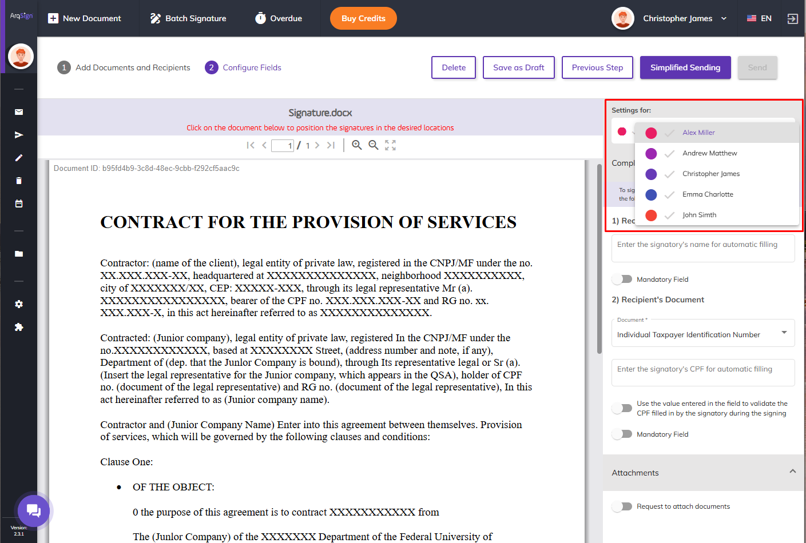

# ✔️ 1.3.PATCH/api/v2/processo/{idProcesso}/reenviar-processo

This service allows clients to **resend the process** to **signatories pending signature** in the current signature order, allowing the **editing of data for those signatories.**

## Request - Guidelines

Required Field ("Sim"): Always required.

Optional Field ("Não"): Information is optional.

Conditional Field ("Talvez"): In some cases, the field will be required. To determine when, consult the topic description according to the line reference number in the table.

<figure><figcaption></figcaption></figure>

## Example Body Request

**Example Body - Without editing**

**\[]**

**Exemplo Body - Com edição → Example Body - With editing**

```
[
    {
        "idProcessoDestinatario": "Guid",
        "idFormaEnvioProcesso": "bit",
        "nome": "string",
        "email": "string",
        "telefone": "string",
        "idMeioEnvioCodigoSeguranca": "bit",
        "emailSeguranca": "string",
        "telefoneSeguranca": "string",
        "permitirReenviarCodigo": "bit",
        "dadosAssinatura": {
            "signatario": {
                "nome": "string",
                "numeroDocumento": "string",
                "validar": "bit"
                "DescartarDadosAnteriores": "bit"
            },
            "empresa": {
                "nome": "string",
                "numeroDocumento": "string",
                "validar": "bit"
                "DescartarDadosAnteriores": "bit"
            }
        }
    }
]
```

## Validations

### General Validations - Authentication

To authenticate in the ArqSign API, you must provide the AppKey of the account resending the process. This account must be active and have the necessary permission to use the ArqSign integration.

### General Validations - JSON Parameter Description

**01.idProcessoDestinatario**

**Description:** Parameter specifying the ID of the recipient to whom the process will be resent.

**Format:** Guid

**Required:** <mark style="color:red;">Yes, when there is data for editing.</mark>

**Validation:** The process can only be resent to recipients with the "Assinar Online" action who have a pending signature action on the documents. It is not allowed to send the process to recipients with the "Receber Cópia" action.

***

**2.IdFormaEnvioProcesso**

**Description:** Parameter specifying the method of resending the process.

**Format:** Bit - 1 - Email or 2 - WhatsApp

**Required:** <mark style="color:blue;">No</mark>

***

**3.nome**

**Description:** Parameter specifying the recipient's name.

**Format:** String

**Required:** <mark style="color:blue;">No</mark>

***

**4.email**

**Description:** Parameter specifying the email to resend the process.

**Format:** String

**Required:** <mark style="color:red;">Yes, when the parameter idFormaEnvio is equal to 1.</mark>

**Validation:** The provided email must be in a valid format.

***

**5.telefone**

**Description:** Parameter specifying the phone number to resend the process.

**Format:** String

**Required:** <mark style="color:red;">Yes, when the parameter idFormaEnvio is equal to 2.</mark>

**Validation:** The process can only be resent via WhatsApp (idFormaEnvioProcesso = 2) when the recipient's signature type is electronic.

***

**6.idMeioEnvioCodigoSeguranca**

**Description:** Security Code data can only be edited for recipients configured with a security code, and it is not allowed to add a security code for recipients not initially configured to use one. Changing the delivery method of the security code is allowed only for recipients with this configuration in the process.

**Format:** Bit - 1 - SMS (Brazil only), 2 – WhatsApp, 3 – Email, or 4 - Do not send

**Required:** <mark style="color:blue;">No</mark>

***

**7.emailSeguranca**

**Description:** Parameter specifying the email for sending the security code.

**Format:** String

**Required:** <mark style="color:red;">Yes, when the parameter idMeioEnvioCodigoSeguranca is equal to 3.</mark>

***

**8.telefoneSeguranca**

**Description:** Parameter specifying the phone number for sending the security code.

**Format:** String

**Required:** <mark style="color:red;">Yes, when the parameter idMeioEnvioCodigoSeguranca is equal to 1 or</mark> 2.

***

**9.permitirReenviarCodigo**

**Description:** Allow resending the security code.

**Format:** Bit - 1 = true or 0 = false

**Required:** <mark style="color:blue;">No</mark>

***

**10.dadosAssinatura**

This part of the JSON is optional and **allows editing the signature data of recipients** with **idTipoAssinatura equal to 1 = electronic**, who have these data configured. These can be used for filling in fields or validating the document when the recipient signs the documents as an individual or company.

When signature data is sent for **recipients not initially configured with these data**, they will be disregarded.

**10.1.Signatário**: Parameters for editing the name and document of the signatory, which will be used for filling in fields on the screen or document validation.

**a. nome**

**Description:** Parameter specifying the name of the signatory to be changed when resending the process.

**Format:** Varchar(250)

**Required:** No

**b. numeroDocumento**

**Description:** Parameter specifying the document of the signatory to be changed when resending the process.

**Format:** String

**Required:** No

**c. validarDocumento**

**Description:** Parameter specifying whether the recipient's document number changed in the **numeroDocumento** parameter of the **signatário** object will be used for validation or not.

**Format:** Bit - 1 – True or 0 - False

**Required:** <mark style="color:blue;">No</mark>

**The data in this parameter will be disregarded when** the **numeroDocumento** parameter in the **signatário** object is null or not sent.

**When this parameter is not sent or is sent** with **null** or **value 0**, it means that the data in the **numeroDocumento** parameter will only be used for **auto-filling at the time** of signing as an individual.

**When this parameter is sent with value 1**, it means that the data in the **numeroDocumento** parameter will be used for **validation** at the time of signing as an individual.

**d. DescartarDadosAnteriores**

**Description:** Parameter specifying whether the data not provided in the signatário object will be discarded.

**Format:** Bit - 1 – True or 0 - False

**Required:** <mark style="color:blue;">No</mark>

**The data in this parameter will be disregarded when** the nome and **numeroDocumento** parameters of the **signatário** object are sent.

**When this parameter is not sent** or is sent with **null** or **value 0**, it means that no parameter in the **signatário** object will be discarded.

**When this parameter is sent with value 1**, it means that the data not provided in the signatário object should be removed from the process.

**10.2.empresa:** Parameters for editing the name and document of the company, which will be used for **filling in fields** on the screen or document validation.


<mark style="color:orange;">**Attention:**</mark> <mark style="color:orange;">**Company data**</mark> <mark style="color:orange;"></mark><mark style="color:orange;">will be</mark> <mark style="color:orange;"></mark><mark style="color:orange;">**disregarded**</mark> <mark style="color:orange;"></mark><mark style="color:orange;">when the signatory is configured to</mark> <mark style="color:orange;"></mark><mark style="color:orange;">**sign only as an individual.**</mark>


**a. nome**

**Description:** Parameter specifying the company name to be updated when resending the process.

**Format:** Varchar(250)

**Required:** <mark style="color:blue;">No</mark>

**b. numeroDocumento**

**Description:** Parameter specifying the company's document to be updated when resending the process.

**Format:** String

**Required:** <mark style="color:blue;">No</mark>

**Validation:** **If this parameter is NOT provided or is null**, and the **DescartarDadosAnteriores** parameter is sent with **the value 1**, the document information will be deleted from the process.

**c. validarDocumento**

**Description:** Parameter indicating whether the company document number updated in the numeroDocumento parameter of the empresa object will be used for validation.

**Format:** Bit: 1 – True or 0 - False

**Required:** <mark style="color:blue;">No</mark>

**The data in this parameter will be disregarded if the numeroDocumento** parameter of the **empresa** object is null.

**If this parameter is not sent** or is sent with **null** or **value 0**, the data in the **numeroDocumento** parameter will be used only for **auto-filling at the time** of signing as a company.

**If this parameter is sent with value 1**, the data in the **numeroDocumento** parameter will be used for **validation** at the time of signing as an individual.

**d. DescartarDadosAnteriores**

**Description:** Parameter indicating whether data not provided in the empresa object will be discarded.

**Format:** Bit: 1 – True or 0 - False

**Required:** <mark style="color:blue;">No</mark>

**The data provided in this** parameter will be disregarded when the **nome** and **numeroDocumento** parameters of the **empresa** object are sent.

**If this parameter is not sent** or is sent with **null** or **value 0**, no parameter in the **empresa** object will be discarded.

**If this parameter is sent with value 1**, data not provided in the **empresa** object will be removed from the process.

## Return Validations

### Error: 400 - Bad Request

This error is returned when the request cannot be interpreted and/or the server attempts to process it, but some parameters are invalid, e.g., a poorly formatted resource or a request attempt with missing data. Request details are provided in the response body and include an error code and an error message.

**a. Mandatory item:** This message will appear in singular or plural when one or more mandatory items are not sent in the API call: _**The listed item(s) is/are mandatory: “comma-separated item names.”**_

**b. Incorrect format:** This message will appear in singular or plural when one or more items are sent in an incorrect format: _**The listed item(s) has/have an incorrect format: “comma-separated item names.”**_

**c. Nonexistent IDs:** This message will appear in singular or plural when one or more IDs sent do not exist: _**The listed ID(s) does/do not exist: “comma-separated table ID names.”**_

**d. Some parameter is incorrect or nonexistent:** This message will appear when the call includes a misspelled parameter or a non-existent piece of information: _**Some parameter is incorrect or nonexistent.**_

### Error: 401 – Unauthorized

This error is returned when:

* The ArqSign API authentication key is incorrect or not properly provided.
* The account has a status other than Active.

### Error: 404 - Not Found

This error is returned when the requested resource or endpoint is not found.

### Error: 422 - Unprocessable

This error is returned when the request was successfully received but contains invalid parameters.

### Error: 500 - Server Error

This error is returned when:

* An internal server error occurs.
* A failure occurs in the ArqSign platform.
* The parameter format is incorrect.
* The JSON format is incorrect.

## Success Response

**Code 200 – OK**

When the process resending is successfully executed, the system will return the data of the participants in the process who are pending document signatures.


<mark style="color:orange;">**Attention: Even if the recipient was not specified for resending, their data will also be returned if they are pending signature.**</mark>


**For example:**

In a process with 3 signatories pending signature:

* When resending the process without editing data, the system will return the data of all 3 signatories pending signature.
* When resending the process while editing the data of one signatory, the system will still return the data of all 3 signatories pending signature.

## Response Example - Body
