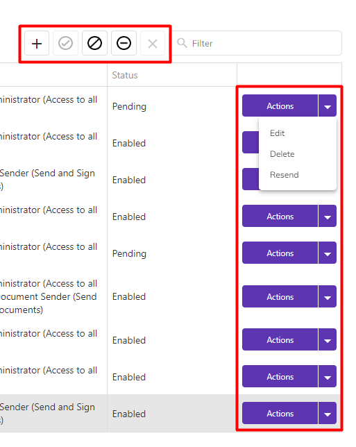

# 💳 Buy Credits

The "Buy Credits" button will be displayed for all users with an active plan (free or paid). If the user exhausts the document sending limit of their plan, they should purchase additional credits to continue sending documents.&#x20;

<figure><figcaption>
Click on the image to enlarge.
</figcaption></figure>

The user can purchase extra credits for sending documents via email and WhatsApp, as well as credits for sending security codes via SMS. If the user's plan includes unlimited document sending via email, it will only be possible to buy credits for sending via WhatsApp and credits for sending security codes via SMS.&#x20;


<mark style="color:orange;">**Extra credits have a validity period of six months for consumption.**</mark>


When clicking on "Buy Credits," the user will be directed to the checkout screen. They should specify the quantity of credits they want to purchase for each type (email, WhatsApp, and SMS) and click "Proceed."&#x20;


<mark style="color:orange;">**If the user's account has unlimited email sending, it will only be possible to purchase extra credits for sending documents via WhatsApp and for sending security codes via SMS.**</mark>&#x20;


<figure><figcaption>
Click on the image to enlarge.
</figcaption></figure>

To complete the purchase, the user should enter the billing and payment information and click "Finalize the Purchase."

<figure><figcaption>
Click on the image to enlarge.
</figcaption></figure>

If the account is shared with other users, all users with a global administrator profile for the account will receive an email notification about the purchase of extra credits.
