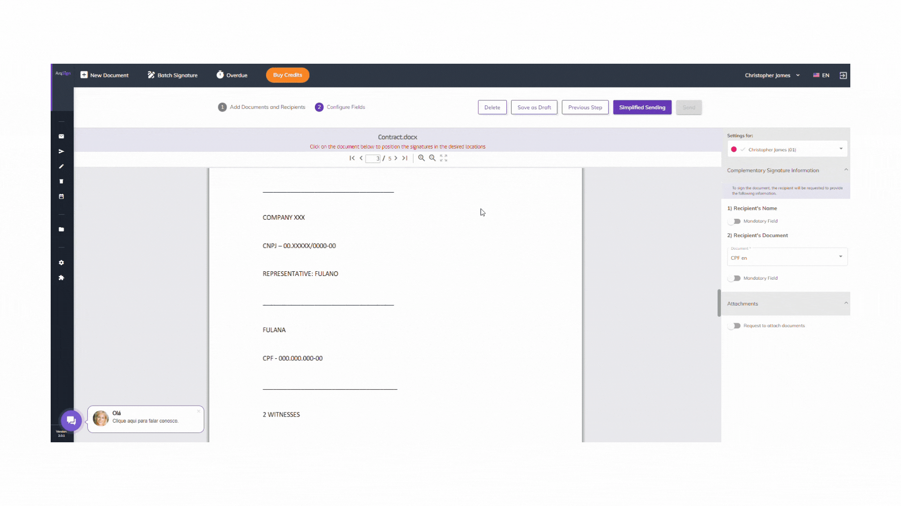
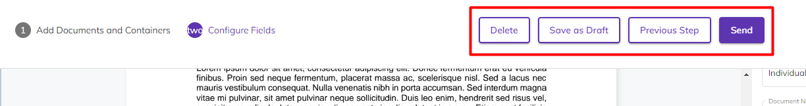

# ➕ New Document

In the "New Document" screen, the user can register one or more documents that will be sent to signatories for signature.

## Step 1: Add Documents and Recipients

### Add Documents (File Upload)

To include the documents that need to be signed, drag the desired files to the document upload field or select them for upload from a directory on your device.

<figure><figcaption>
Click on the image to enlarge.
</figcaption></figure>

You can include more than one file in the same signing process. In this case, the **"Group files into a single document**" option will be available and can be checked or unchecked.&#x20;

When this option is **checked**, ArqSign displays the **grouped files** in the listing area, where you can change the order of the documents by clicking and dragging them to the desired position. In this case, it is not allowed to change the name of each individual file, only the name of the process.

<figure><figcaption>
Click on the image to enlarge.
</figcaption></figure>

To remove a file, click the trash icon available for each file on the screen.&#x20;

When this option is **unchecked**, ArqSign displays the files as **separate items** in the listing area, allowing you to change the order and the names of the files.

<figure><figcaption>
Click on the image to enlarge.
</figcaption></figure>


<mark style="color:orange;">**The following file extensions are allowed:**</mark>

* <mark style="color:orange;">**Document: .doc, .docx, .pdf, .txt**</mark>
* <mark style="color:orange;">**Image: .jpg, .jpeg, .png, .tif, .tiff**</mark>
* <mark style="color:orange;">**Presentation: .ppt, .pptx**</mark>
* <mark style="color:orange;">**Spreadsheet: .csv, .xls, .xlsx**</mark>

<mark style="color:orange;">**Each file can be up to 35MB or up to 2000 pages, and the total file size cannot exceed 100MB.**</mark>


In the **"Signature Process Name"** field, you can edit the name of the process that includes the grouped files as needed.

<figure><figcaption>
Click on the image to enlarge.
</figcaption></figure>

In the **"Folder"** field, select the folder where the document will be stored. The folders where documents can be saved must be created in the [Directories > Documents](../directories/documents/) menu. By default, a folder with the user's name is created and should be selected if no other folder exists.

<figure><figcaption>
Click on the image to enlarge.
</figcaption></figure>

Finally, to schedule the automatic renewal of the documents being registered, check the box for the **"Schedule renewal \_\_\_ months after completion of signatures"** field, specifying the number of months you want to be notified about the renewal process. Once the signatures for the initial submission are completed, the system will start counting the specified period. When the renewal period is reached, the person responsible for the documents (sender) will receive a notification indicating that the documents are ready to be renewed.

<figure><figcaption>
Click on the image to enlarge.
</figcaption></figure>

## Advanced settings

The advanced settings pertain to document-specific configurations. Each setting has a default value, which can be adjusted either universally in the [Administration > Account > Settings](../administration/administration/account.md#settings-tab) menu for all documents or specifically on the New Document screen.

**Document expiration time after sending:** In this field, the user should specify the expiration period (in days) for the document, which is the deadline for recipients to sign it.


<mark style="color:orange;">If this field is not modified, it will be filled with the default value. The system default is 120 days, but this value can be changed in the</mark> [<mark style="color:orange;">**Administration > Account > Settings menu.**</mark>](../administration/administration/account.md#settings-tab)


**Warning before expiration:** In this field, specify the period (in days) before which the system should send a warning to recipients who have not yet signed about the document's expiration.

**Enable reminders:** By enabling this option, the system will send reminders to recipients to sign the document. These reminders will only be sent to signatories who have not yet signed the document. By default, this option will be checked.

**Send reminders to recipients every:** In this field, specify how often (in days) the system should send signing reminders to recipients who have not yet signed.

**Require signatories to read documents before signing:** This setting requires that signatories read the documents before signing. This information will be checked or unchecked based on the account configuration.

**Generate document access QR Code in Signature Record:** By enabling this option, a QR Code will be generated in the document's signature record. By default, this option will be unchecked.

When you hover over the "Advanced Settings" option, a tooltip will appear showing a preview of the configured settings.

<figure><figcaption>
Click on the image to enlarge.
</figcaption></figure>

To edit the settings for a specific file, click on **Advanced Settings**, as shown in the image below.

<figure><figcaption>
Click on the image to enlarge.
</figcaption></figure>

<figure><figcaption>
Click on the image to enlarge.
</figcaption></figure>

***

## Recipients&#x20;

In the "Recipients" field, fill out the information for the signatories who will receive the document and participate in the signing process. Follow the settings described below for each recipient.&#x20;

<figure><figcaption>
Click on the image to enlarge.
</figcaption></figure>

To add a recipient saved in the contacts list, click on the "Add recipient from my contacts" icon. The contacts list must be created beforehand in the "My Profile" menu.

<figure><figcaption></figcaption></figure>


<mark style="color:blue;">**Important**</mark><mark style="color:blue;">: The contact list must be created beforehand in the</mark> [<mark style="color:blue;">"My Profile"</mark>](my-profile.md) <mark style="color:blue;">menu.</mark>


When you click on this button, the list is displayed. To add the desired recipients, select them by clicking on the checkbox next to their name and then click on "Add Recipients."

<figure><figcaption></figcaption></figure>

By checking the "Sign in the order below" checkbox, the document will be sent to recipients in the sequence defined in the "Order" field, which will appear at the top of the "Recipient Details" section. When this option is set, each recipient will only receive the document after the previous one has completed their signing action.


<mark style="color:orange;">**If the previous user only had a viewing action without signing, the next signatory will receive the document after the last signatory before them completes their signature.**</mark>


<figure><figcaption></figcaption></figure>

**Recipient Name:** Enter the recipient's name.

**Send via:** Select whether the document will be sent via email or WhatsApp to the recipient.


<mark style="color:orange;">**The option to send via WhatsApp will only be displayed if the user's account has WhatsApp message credits available.**</mark>


Depending on the option chosen previously, provide the recipient's email address or phone number for sending the document.

<figure><figcaption></figcaption></figure>

**This recipient will:** Specify whether the recipient will electronically sign the document as an Individual (Pessoa Física), Legal Entity (Pessoa Jurídica), both, or if they will only receive a copy of the document at the end of the signing process.

<figure><figcaption></figcaption></figure>

If it has been determined that the recipient will sign as an individual (pessoa física) or legal entity (pessoa jurídica), it is necessary to define their role in the signing process. Select from one or more roles listed or add a custom "Signatory Role" by clicking on "Add Role".

<figure><figcaption>
Click on the image to enlarge.
</figcaption></figure>

 

<figure><figcaption>
Click on the image to enlarge.
</figcaption></figure>

The signer roles presented here are previously created in the menu [Administration > Account > Settings Tab > Signer Role](../administration/administration/account.md#documents-sub-tab). By default, the platform shows the roles "Contracted," "Contractor," "Guarantor," and "Tenant," but you can edit or delete these roles, as well as create new ones if necessary.

<figure><figcaption></figcaption></figure>

**Signature Type:** Select whether the recipient should use an electronic signature or a digital certificate to sign the document.

<figure><figcaption>
Click on the image to enlarge.
</figcaption></figure>


<mark style="color:blue;">**Electronic Signature vs Digital Signature (ICP Brazil and Others)**</mark>&#x20;

&#x20;&#x20;

<mark style="color:blue;">An electronic signature is one that does not require a digital certificate. It is commonly used for signing contracts and documents between private entities (B2B, B2C).</mark>&#x20;

<mark style="color:blue;">A digital signature, on the other hand, requires a digital certificate. It is primarily used for issuing invoices and transactions with the government.</mark>&#x20;

<mark style="color:blue;">In the ArqSign platform, when configuring a signature workflow, you can determine which type of signature should be executed by the recipient, choosing between:</mark>&#x20;

<mark style="color:blue;">a) Electronic Signature (ArqSign produces advanced electronic signatures with legal validity according to MP 2.200-2 of 08/24/2001 and Law 14.063 of 11/23/2020). Whenever a signer electronically signs a document, ArqSign applies its own digital certificate, capturing the hash (unique identification) of the file, verifying file integrity, and attaching the signer's identification to the certificate.</mark>&#x20;

<mark style="color:blue;">b) Digital Signature – ICP-Brazil or Others (ArqSign produces qualified digital signatures according to MP 2.200-2 of 08/24/2001 and Law 14.063 of 11/23/2020). When a user already possesses a digital certificate and wishes to use it for signing through ArqSign, this certificate is used to verify the integrity of the signature and identify the user as the signer on the document.</mark>&#x20;


When selecting the option 'Save this recipient to my contact list,' the recipient's provided data will be automatically saved to the user's contact list.

<figure><figcaption></figcaption></figure>

**Security Code Icon:** Clicking on this icon allows you to generate a numerical code that will be sent to the recipient for accessing the document. The code can be automatically generated by the system or manually entered by the user.

<figure><figcaption></figcaption></figure>

After generating the code, choose whether it will be sent via email, WhatsApp, or SMS, and provide the email address or phone number for sending. It's also possible to not send the code, allowing the user to inform the recipient in their preferred manner. To delete the created code, simply click on 'Delete Security Code.

<figure><figcaption></figcaption></figure>

If the option to send via WhatsApp is selected, it's possible to allow the recipient to request a resend of the code by checking the 'Allow this recipient to request a resend of the security code' checkbox.


<mark style="color:orange;">Each resend of the security code requested by the recipient will consume a WhatsApp credit from the sending user's account.</mark>


<figure><figcaption></figcaption></figure>

**Private Message Icon:** Clicking on this icon allows you to insert a message that will be sent to the recipient along with the document. To do this, fill in the 'Subject' and 'Message' fields. If you wish to delete the private message, click on 'Delete Private Message'.

<figure><figcaption></figcaption></figure>

The **Security Code** and **Private Message** items are expandable, and when collapsed, they feature an edit icon, indicating to the user that they can be modified.

<figure><figcaption></figcaption></figure>

To add other recipients, click the "Add New Recipient" button. If you wish to include yourself as a recipient, click "Add me as a recipient." The name and email fields will be automatically filled with the information registered in your user profile, and the "Send via" field will be filled with the "Email" option.

<figure><figcaption></figcaption></figure>

&#x20;

***

## Default Message

In the "**Default Message"** field, the default message to be sent to all recipients must be defined by filling in the "Subject" and "Message" fields.&#x20;


<mark style="color:orange;">**In the case of recipients who have the Custom Message fields filled, the provided message will be sent in place of the default message.**</mark>&#x20;


<figure><figcaption>
Click on the image to enlarge.
</figcaption></figure>

After completing these settings, click "**Next**" to proceed to the next step, "Save as Draft" to save the document as a draft, or "Delete" to cancel the registration.

<figure><figcaption>
Click on the image to enlarge.
</figcaption></figure>

***

## Step 2: Configure Fields

In the next step, the documents that were inserted in the previous stage in PDF format will be displayed, and the signature fields, filling information, and attachments should be configured.

#### Process with one or more grouped documents

When the process has one or more grouped documents, the system displays the name of the process.

<figure><figcaption></figcaption></figure>

#### Process with more than one ungrouped document&#x20;

When the process has one or more ungrouped documents, the system displays:

* At the top of the screen, the **name of the document** being displayed;
* In the left corner of the screen, the **list of documents in the process**, ordered according to the sequence set in [Step 01](new-document.md#step-1-add-documents-and-recipients), indicating whether the document is being viewed or not. Clicking on a document will display it on the screen.

<figure><figcaption></figcaption></figure>

## Signature fields

#### Signature representation

Clicking on the document, the system displays a configuration modal for the visual representation, listing the signatories pending configuration of the signature representation, ordered alphabetically or according to the signing order defined in [Step 01](new-document.md#step-1-add-documents-and-recipients).

For each listed document, the system shows the respective representation(s) for each signatory according to the type of signature defined in [Step 01](new-document.md#step-1-add-documents-and-recipients) (field 'This Recipient Will'), allowing the user to configure the representation for each signatory with an online signing action for each document.

<figure><figcaption></figcaption></figure>

Upon including the configuration of the visual representation, the application displays the representation on the document in the position where the user placed it, allowing the user to adjust the size and/or delete the inserted signature representation.

<figure><figcaption></figcaption></figure>

If in Step 1 it was defined that the recipient will sign as both an individual and a legal entity, two boxes will be displayed with the recipient's name in the same color. The boxes for each recipient will be shown in different colors to visually indicate where each should sign.

#### Visual signature representation modal for a process with one or more grouped documents

When the process has one or more grouped documents, the system lists the recipients' representations according to the type of person (individual and/or legal entity), displaying a scrollbar in the modal."

<figure><figcaption></figcaption></figure>

#### Visual signature representation modal for a process with more than one ungrouped document

When the process has more than one document, the system displays a 'carousel,' allowing navigation between documents and signatories.

<figure><figcaption></figcaption></figure>

<figure><figcaption></figcaption></figure>

Upon completing the configuration of the signature for all signatories on the document, the system marks the document as having completed the representation configuration by turning the checkmark green in the left corner of the screen.

Once the signature configuration for the signatory is completed across all documents, the system indicates that the representation configuration for that signatory is complete by turning the checkmark green next to each signatory's name.

<figure><figcaption></figcaption></figure>

## Signature data and attachments

In the top right corner of the screen, the 'Settings for' field is displayed, showing the name of the recipient currently selected for configuration. Each recipient is automatically assigned a color by the platform, and next to this icon, a 'checked' symbol appears. This symbol changes color to green to indicate that the Additional Signature Information has been included or remains gray when it has not been included.

<figure><figcaption></figcaption></figure>

If no signature order is configured in Step 1, the **'Settings for'** item displays the list of signatories sorted alphabetically. If a signature order is configured, the list of signatories will be grouped by the order of signatures and sorted alphabetically.

<figure><figcaption></figcaption></figure>

***

## Simplified Sending

If the user does not wish to manually insert signatures into the document, they can select the **Simplified Sending** option.

<figure><figcaption></figcaption></figure>

**Simplified Sending** allows the user to send the process without manually adjusting the signature positions. Instead, the platform automatically inserts a page at the end of the document with the signature representations, considering the settings defined earlier during document insertion and the following rules:


<mark style="color:blue;">**If the 'Group files into a single document' field in Step 1 is unchecked:**</mark> \ <mark style="color:blue;">The platform</mark> <mark style="color:blue;"></mark><mark style="color:blue;">**inserts a page at the end of each document**</mark> <mark style="color:blue;"></mark><mark style="color:blue;">with the signature position for each recipient with an Online Signing action, according to the type of signature for each one (Individual and/or Legal Entity) configured in the 'This Recipient Will' field.</mark>

<mark style="color:blue;">**If the 'Group files into a single document' field in Step 1 is checked:**</mark> \ <mark style="color:blue;">The platform</mark> <mark style="color:blue;"></mark><mark style="color:blue;">**inserts a page at the end of the document**</mark> <mark style="color:blue;"></mark><mark style="color:blue;">with the signature position for each recipient with an Online Signing action, according to the type of signature for each one (Individual and/or Legal Entity) configured in the 'This Recipient Will' field.</mark>



<mark style="color:red;">If the user has previously chosen to</mark> <mark style="color:red;"></mark><mark style="color:red;">**manually configure the signature**</mark> <mark style="color:red;"></mark><mark style="color:red;">on any document in the process, the system will display a confirmation message for Simplified Sending. Upon confirmation, the manually inserted fields will be deleted, and all signatures will be positioned on the automatically generated page created by the platform."</mark>


<figure><figcaption></figcaption></figure>

### Complementary Signature Information&#x20;

Depending on the type of signature defined for the recipient in step 1, the "**Complementary signature Information**" fields will be displayed. These fields will only be shown if the option "Electronic Signature" was chosen in step 1 in the "Signature Type" field.&#x20;

If the signature is as an Individual, it is possible to require the recipient's name and some document by selecting the options "Individual's Name" and "Individual's Document" as mandatory fields.&#x20;

<figure><figcaption>
Click on the image to enlarge.
</figcaption></figure>

<mark style="color:purple;">To require a document, select the desired option among CPF, CNH, RG, or others. If the last option is selected, you will need to provide the document's name, specify if it is text or numeric, and indicate the number of characters.</mark>&#x20;

If the signature is as a Legal Entity, it is possible to require the recipient's company name and some document by selecting the options "Legal Entity Name" and "Legal Entity Document" as mandatory fields.&#x20;

To require a document, select the desired option among Driver's License, Identity or others. If the last option is selected, you will need to provide the document name, specify if it is text or numeric, and indicate the number of characters.

<figure><figcaption>
Click on the image to enlarge.
</figcaption></figure>

If the signature is as a Legal Entity, it is possible to require the recipient to provide the company's legal name and some document by checking the options "Legal Entity Name" and "Legal Entity Document" as mandatory fields.

***

### Attachments&#x20;

In the "Attachments" section on the left side of the screen, configurations will be displayed that allow recipients to attach other files to the document at the time of signing. To enable this, check the option "**Allow attaching documents**."&#x20;

Provide the name of the attachment that will be requested and specify whether it will be mandatory to fill in and if all participating recipients in the signature workflow will be able to view the file attached by the recipient.&#x20;

It is possible to request more than one attachment by clicking on the "**Add**" icon.&#x20;

<figure><figcaption>
Click on the image to enlarge.
</figcaption></figure>

By clicking "**Delete,**" the document will be deleted. Clicking "**Save as Draft**" will save the document in the Drafts folder. To edit the document or recipients, click "**Previous Step**." Once the signature field configurations are completed, click "**Send**" to submit the document for the recipients' signatures.&#x20;

<figure><figcaption>
Click on the image to enlarge.
</figcaption></figure>
