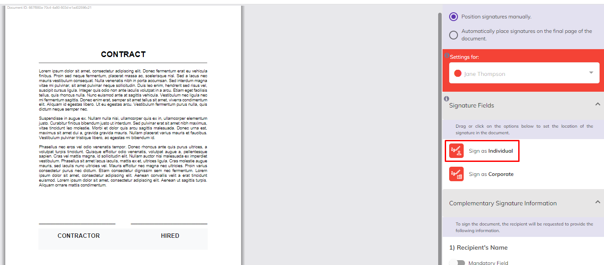
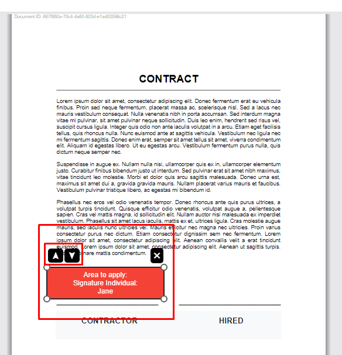
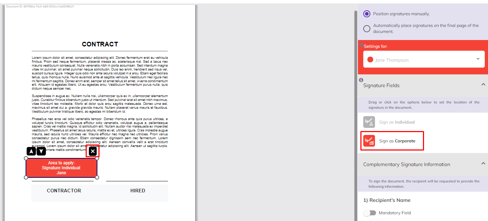

# ➕ New Document

On the New Document screen, the user will be able to register a document that will be sent to other users (signatories) for signature.&#x20;

## Step 1: Add Documents and Recipients

### Add Documents (Upload files)

To include the documents that need to be signed, drag the desired files to the document upload field or select them for upload from a directory on your device.

<figure><figcaption>
Click on the image to enlarge.
</figcaption></figure>

You can include more than one file in the same signing process. In this case, the **"Group files into a single document**" option will be available and can be checked or unchecked.&#x20;

When this option is **checked**, ArqSign displays the **grouped files** in the listing area, where you can change the order of the documents by clicking and dragging them to the desired position. In this case, it is not allowed to change the name of each individual file, only the name of the process.

<figure><figcaption></figcaption></figure>

To remove a file, click the trash icon available for each file on the screen.&#x20;

When this option is **unchecked**, ArqSign displays the files as **separate items** in the listing area, allowing you to change the order and the names of the files.

<figure><figcaption></figcaption></figure>


<mark style="color:orange;">**The following file extensions are allowed:**</mark>

* <mark style="color:orange;">**Document: .doc, .docx, .pdf, .txt**</mark>
* <mark style="color:orange;">**Image: .jpg, .jpeg, .png, .tif, .tiff**</mark>
* <mark style="color:orange;">**Presentation: .ppt, .pptx**</mark>
* <mark style="color:orange;">**Spreadsheet: .csv, .xls, .xlsx**</mark>

<mark style="color:orange;">**Each file can be up to 35MB or up to 2000 pages, and the total file size cannot exceed 100MB.**</mark>


In the **"Signature Process Name"** field, you can edit the name of the process that includes the grouped files as needed.

<figure><figcaption></figcaption></figure>

In the **"Folder"** field, select the folder where the document will be stored. The folders where documents can be saved must be created in the [Directories > Documents](../directories/documents/) menu. By default, a folder with the user's name is created and should be selected if no other folder exists.

<figure><figcaption></figcaption></figure>

Finally, to schedule the automatic renewal of the documents being registered, check the box for the **"Schedule renewal \_\_\_ months after completion of signatures"** field, specifying the number of months you want to be notified about the renewal process. Once the signatures for the initial submission are completed, the system will start counting the specified period. When the renewal period is reached, the person responsible for the documents (sender) will receive a notification indicating that the documents are ready to be renewed.

<figure><figcaption></figcaption></figure>

## Advanced settings

Advanced settings pertain to document configurations. You can adjust these settings either as a default for all documents, meaning a standard configuration for every time signatures are needed, or configure options for a specific document individually. To access the full list of options that can be configured for documents, go to the [Administration > Account > Settings](../administration/administration/account.md#settings-tab) menu. Below are all the general configurable options:

**Document expiration time after sending:** In this field, the user should specify the expiration period (in days) for the document, which is the deadline for recipients to sign it.


<mark style="color:orange;">If this field is not modified, it will be filled with the default value. The system default is 120 days, but this value can be changed in the</mark> [<mark style="color:orange;">**Administration > Account > Settings menu.**</mark>](../administration/administration/account.md#settings-tab)


**Warning before expiration:** In this field, specify the period (in days) before which the system should send a warning to recipients who have not yet signed about the document's expiration.

**Enable reminders:** By enabling this option, the system will send reminders to recipients to sign the document. These reminders will only be sent to signatories who have not yet signed the document. By default, this option will be checked.

**Send reminders to recipients every:** In this field, specify how often (in days) the system should send signing reminders to recipients who have not yet signed.

**Require signatories to read documents before signing:** This setting requires that signatories read the documents before signing. This information will be checked or unchecked based on the account configuration.

**Generate document access QR Code in Signature Record:** By enabling this option, a QR Code will be generated in the document's signature record. By default, this option will be unchecked.

When you hover over the "Advanced Settings" option, a tooltip will appear showing a preview of the configured settings.

<figure><figcaption></figcaption></figure>

To edit the settings for a specific file, click on **Advanced Settings**, as shown in the image below.

<figure><figcaption></figcaption></figure>

<figure><figcaption></figcaption></figure>

***

## Recipients&#x20;

In the "Recipients" field, fill in the details for the signatories who will receive the document and participate in the signing process. The following settings need to be configured for each recipient:

<figure><figcaption></figcaption></figure>

You can add a recipient from a saved contact list by clicking the **"Add recipient from my contacts"** icon.


<mark style="color:blue;">**Important**</mark><mark style="color:blue;">: The contact list must be created beforehand in the</mark> [<mark style="color:blue;">"My Profile"</mark>](my-profile.md) <mark style="color:blue;">menu.</mark>


In the "**Recipients**" field, fill in the fields related to the users who will receive the document and participate in the signing process. The following configurations need to be performed for each of the recipients.&#x20;

To add a recipient saved in the contact list, click on the "**Add a recipient from my contact list**" icon. The contact list must be created beforehand in the My Profile menu.&#x20;

<figure><figcaption>
Click on the image to enlarge.
</figcaption></figure>

By clicking this button, the list is displayed. To add the desired recipients, select them by clicking the checkbox next to their name and click "**Add Containers**."

<figure><figcaption>
Click on the image to enlarge.
</figcaption></figure>

By checking the **"Sign in order below"** checkbox, the document will be sent to recipients in the order defined in the **"Order"** field that will appear at the top of the "Recipient Data." When this option is set, a user will only receive the document after the preceding one completes their signing or viewing action.


<mark style="color:orange;">**If the previous user only had viewing access, the next signer will receive the document when the last signer before them completes the signature.**</mark>


<figure><figcaption>
Click on the image to enlarge.
</figcaption></figure>

**Recipient's name:** Enter the recipient's name.&#x20;

<mark style="color:purple;">**Send by:**</mark> <mark style="color:purple;"></mark><mark style="color:purple;">Select whether the document will be sent by email or Whatsapp to the recipient.</mark>

<figure><figcaption>
Click on the image to enlarge.
</figcaption></figure>

If it has been determined that the recipient will sign as an individual (pessoa física) or legal entity (pessoa jurídica), it is necessary to define their role as a signatory in the process. Choose from Contractor (Contratada), Contracting Party (Contratante), Guarantor (Fiador), Party (Parte), or add a custom "**Signatory's Role**" by clicking "**Add Role.**"

The signer roles presented here are previously created in the Administration > Account > Settings > Signer Role tab. By default, the platform presents roles such as "Contractor", "Contractee", "Guarantor", "Party", and "Witness", but it is possible to edit or delete these roles, as well as create others if necessary.

<figure><figcaption>
Click on the image to enlarge.
</figcaption></figure>

 

<figure><figcaption>
Click on the image to enlarge.
</figcaption></figure>

**Signature Type:** Select whether the recipient should use an electronic signature or a digital certificate to sign the document.

<figure><figcaption>
Click on the image to enlarge.
</figcaption></figure>

By selecting the option **"Save this recipient to my contact list,"** the recipient's provided data will be automatically saved to the user's contact list.

<figure><figcaption>
Click on the image to enlarge.
</figcaption></figure>

**"Security Code" Icon:** By clicking on this icon, a numerical code can be created and sent to the recipient for document access. The code can be generated automatically by the system or manually input by the user.

<figure><figcaption>
Click on the image to enlarge.
</figcaption></figure>

After generating the code, choose whether it will be sent via email or SMS, and provide the email or phone number for delivery. It is also possible not to send the code, allowing the user to inform the recipient in their preferred manner. To delete the created code, simply click on "**Delete Security Code**."

<figure><figcaption>
Click on the image to enlarge.
</figcaption></figure>

**Custom Message Icon:** By clicking on this icon, you can insert a message that will be sent to the recipient along with the document. To do this, fill in the "Subject" and "Message" fields. If you wish to delete the message, click on **"Delete Customized Message."**

<figure><figcaption>
Click on the image to enlarge.
</figcaption></figure>

To add other recipients, click on the "**Add New Recipient**" button.&#x20;

To include yourself as a recipient, click on **"Add me as a recipient".** The name and email fields will be automatically filled with the information registered in your user profile, and the "Send via" field will be filled with the "Email" option.&#x20;

<figure><figcaption>
Click on the image to enlarge.
</figcaption></figure>

***

### C. Default Message

In the "**Default Message"** field, the default message to be sent to all recipients must be defined by filling in the "Subject" and "Message" fields.&#x20;


<mark style="color:orange;">**In the case of recipients who have the Custom Message fields filled, the provided message will be sent in place of the default message.**</mark>&#x20;


<figure><figcaption>
Click on the image to enlarge.
</figcaption></figure>

After completing these settings, click "**Next**" to proceed to the next step, "Save as Draft" to save the document as a draft, or "Delete" to cancel the registration.

<figure><figcaption>
Click on the image to enlarge.
</figcaption></figure>

***

## Step 2: Configure Fields

In the next step, the documents inserted in the previous stage will be displayed in PDF format, and the areas where participants in the process should sign need to be configured.

<figure><figcaption>
Click on the image to enlarge.
</figcaption></figure>

### Signature Fields&#x20;

In the right corner of the screen, choose between "**Position signatures manually**" to select where the signature areas will be placed in the document, or "**Automatically place signatures on the page of the document**" so that all signatures are inserted at the end of the last page of the document.&#x20;

For each recipient added in the first step, it is necessary to configure the signature area. To do this, select the recipient in the "**Settings for**" field.&#x20;

<figure><figcaption>
Click on the image to enlarge.
</figcaption></figure>

If the option **"Position Signatures Manually"** was chosen, the **"Signature Fields"** section will be displayed. To create the signature area, drag the **"Sign as Individual"** box to the part of the document where you  want the signature to be inserted.

<figure><figcaption></figcaption></figure>

The signature area as an individual with the signatory's name will be inserted into the document. It will be possible to resize, enlarge, shrink, and position the signature area by dragging with the cursor or using the arrows.

<figure><figcaption></figcaption></figure>

If the recipient will also sign as a legal entity, click on **"Sign as Corporate"** and repeat the process. To delete a signature area, click on the **"Delete"** icon above the area.

<figure><figcaption></figcaption></figure>

If the option "**Automatically place signatures on the page of the document**" has been chosen, a page will be inserted at the end of the document where signatures and signatory information will be displayed in an orderly manner. The role that the signer has in the contract is also displayed.

If in [step 1](new-document.md#step-1-add-documents-and-recipients) it was defined that the recipient will sign as an individual and a legal entity, two boxes with their names in the same color should be inserted. The boxes for each of the recipients will be displayed in different colors to visually signal where each should sign.&#x20;


<mark style="color:orange;">**Note that the boxes for recipients are of the same color as shown in the "Settings for" field.**</mark>&#x20;


<figure><figcaption>
Click on the image to enlarge.
</figcaption></figure>

***

### Complementary Signature Information&#x20;

Depending on the type of signature defined for the recipient in step 1, the "**Complementary signature Information**" fields will be displayed. These fields will only be shown if the option "Electronic Signature" was chosen in step 1 in the "Signature Type" field.&#x20;

If the signature is as an Individual, it is possible to require the recipient's name and some document by selecting the options "Individual's Name" and "Individual's Document" as mandatory fields.&#x20;

<figure><figcaption>
Click on the image to enlarge.
</figcaption></figure>

<mark style="color:purple;">To require a document, select the desired option among CPF, CNH, RG, or others. If the last option is selected, you will need to provide the document's name, specify if it is text or numeric, and indicate the number of characters.</mark>&#x20;

If the signature is as a Legal Entity, it is possible to require the recipient's company name and some document by selecting the options "Legal Entity Name" and "Legal Entity Document" as mandatory fields.&#x20;

To require a document, select the desired option among Driver's License, Identity or others. If the last option is selected, you will need to provide the document name, specify if it is text or numeric, and indicate the number of characters.

<figure><figcaption>
Click on the image to enlarge.
</figcaption></figure>

If the signature is as a Legal Entity, it is possible to require the recipient to provide the company's legal name and some document by checking the options "Legal Entity Name" and "Legal Entity Document" as mandatory fields.

***

### Attachments&#x20;

In the "Attachments" section on the left side of the screen, configurations will be displayed that allow recipients to attach other files to the document at the time of signing. To enable this, check the option "**Allow attaching documents**."&#x20;

Provide the name of the attachment that will be requested and specify whether it will be mandatory to fill in and if all participating recipients in the signature workflow will be able to view the file attached by the recipient.&#x20;

It is possible to request more than one attachment by clicking on the "**Add**" icon.&#x20;

<figure><figcaption>
Click on the image to enlarge.
</figcaption></figure>

By clicking "**Delete,**" the document will be deleted. Clicking "**Save as Draft**" will save the document in the Drafts folder. To edit the document or recipients, click "**Previous Step**." Once the signature field configurations are completed, click "**Send**" to submit the document for the recipients' signatures.&#x20;

<figure><figcaption>
Click on the image to enlarge.
</figcaption></figure>
