# ➕ New Document

On the New Document screen, the user will be able to register a document that will be sent to other users (signatories) for signature.&#x20;

## Step 1: Add Documents and Recipients

### A. Add Documents&#x20;

#### Advanced Settings

The advanced settings are settings related to the document. All of them have a default value, which can be adjusted in the Administration > Account > Settings menu for all documents or specifically on the New Document screen.

* **Document Expiration Time after Sending:** In this field, the user must specify the expiration period (in days) for the document, i.e., the deadline for recipients to sign it.&#x20;


<mark style="color:orange;">**If this field is not modified, it will be filled with the default value. The system's default value is 120 days, but this can be changed in the Administration menu > Account > Settings.**</mark>


* **Expiration Warning:** In this field, the user should specify the period (in days) during which the system should send a notification to recipients who have not yet signed, warning them about the document's expiration.
* **Activate Reminders:** By activating this option, the system will send reminders to recipients to sign the document. These reminders will be sent only to signatories who have not yet signed the document. By default, this option will be marked.
* **Send Reminders to Recipients Every:** In this field, specify how often (in days) the system should send signature reminders to recipients who have not yet signed.
* **Generate Access QR Code in the Signature Log:** By activating this option, a QR code will be generated in the signature log document. By default, this option will be unchecked.

<figure>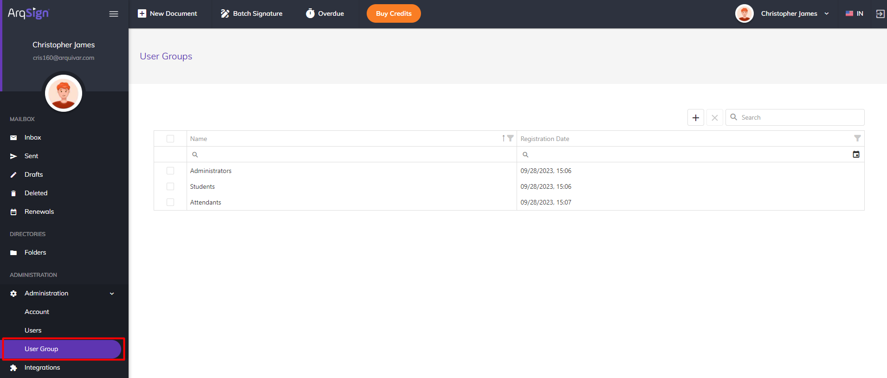<figcaption>
Click on the image to enlarge.
</figcaption></figure>

To include the document that needs to be signed, select or drag the desired file to the document inclusion field. More than one file can be included.

Multiple files can be included in the same submission. In this case, the files are grouped into a single archive.


<mark style="color:orange;">**Files with the following extensions are allowed:**</mark>&#x20;

<mark style="color:orange;">**Document: .doc, .docx, .pdf, .txt.**</mark>&#x20;

<mark style="color:orange;">**Image: .jpg, .jpeg, .png, .tif, .tiff.**</mark>&#x20;

<mark style="color:orange;">**Presentation: .ppt, .pptx.**</mark>&#x20;

<mark style="color:orange;">**Spreadsheet: .csv, .xls, .xlsx.**</mark>&#x20;

<mark style="color:orange;">**Each file can have up to 35MB or up to 2000 pages, with a total limit of 100MB.**</mark>


<figure><figcaption>
Click on the image to enlarge.
</figcaption></figure>

In the **"Document Name"** field, edit the document name. To delete a file after uploading, click on the "Delete" icon next to the file name.

<figure><figcaption>
Click on the image to enlarge.
</figcaption></figure>

In the **"Document Folder"** field, select the folder where the document will be hosted. The folders in which documents can be stored should be created in the Directories > Documents menu. By default, a folder with the user's name is created and should be selected if no other folder exists.

<figure><figcaption>
Click on the image to enlarge.
</figcaption></figure>

To schedule the automatic renewal of the document being registered, select the checkbox in the **"Schedule renewal \_\_\_ months after completion of signatures"** field, specifying the number of months in which you want the document to be renewed. Once the signatures from the initial submission are completed, the system will start counting the specified period. When the renewal period is reached, the document owner (sender) will receive a notification indicating that the document is ready for renewal.

<figure>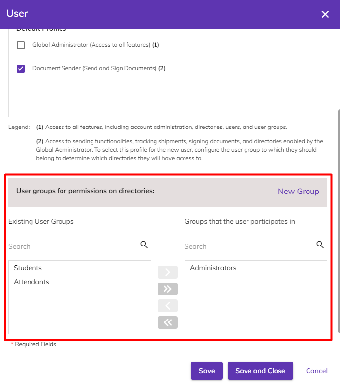<figcaption>
Click on the image to enlarge.
</figcaption></figure>

***

### B. Recipients&#x20;

In the "**Recipients**" field, fill in the fields related to the users who will receive the document and participate in the signing process. The following configurations need to be performed for each of the recipients.&#x20;

To add a recipient saved in the contact list, click on the "**Add recipient from my contacts**" icon. The contact list must be created beforehand in the My Profile menu.&#x20;

<figure>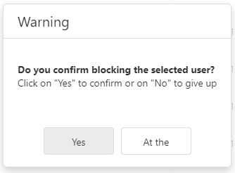<figcaption>
Click on the image to enlarge.
</figcaption></figure>

By clicking this button, the list is displayed. To add the desired recipients, select them by clicking the checkbox next to their name and click "**Add Recipients**."

<figure><figcaption>
Click on the image to enlarge.
</figcaption></figure>

By checking the **"Sign in the order below"** checkbox, the document will be sent to recipients in the order defined in the **"Order"** field that will appear at the top of the "Recipient Data." When this option is set, a user will only receive the document after the preceding one completes their signing or viewing action.


<mark style="color:orange;">**If the previous user only had viewing access, the next signer will receive the document when the last signer before them completes the signature.**</mark>


<figure><figcaption>
Click on the image to enlarge.
</figcaption></figure>

**Name:** Provide the recipient's name.&#x20;

**This recipient will:** Specify whether the recipient will sign the document online as an individual (Pessoa Física), as a legal entity (Pessoa Jurídica), or if they will only receive a copy of the document at the end of the signing process.

<figure><figcaption>
Click on the image to enlarge.
</figcaption></figure>

If it has been determined that the recipient will sign as an individual or a legal entity, it is necessary to define their role as a signer in the process. Select from one or more roles listed or add a custom "**Signer Role"** by clicking "**Add Role**".

The signer roles presented here are previously created in the Administration > Account > Settings > Signer Role tab. By default, the platform presents roles such as "Contractor", "Contractee", "Guarantor", "Party", and "Witness", but it is possible to edit or delete these roles, as well as create others if necessary.

<figure><figcaption>
Click on the image to enlarge.
</figcaption></figure>

 

<figure><figcaption>
Click on the image to enlarge.
</figcaption></figure>

**Signature Type:** Select whether the recipient should use an electronic signature or a digital certificate to sign the document.

<figure><figcaption>
Click on the image to enlarge.
</figcaption></figure>

By selecting the option **"Save this recipient to my contacts list,"** the recipient's provided data will be automatically saved to the user's contact list.

<figure>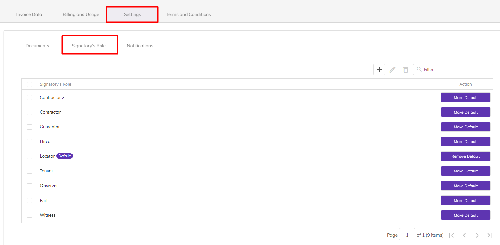<figcaption>
Click on the image to enlarge.
</figcaption></figure>

**"Security Code" Icon:** By clicking on this icon, a numerical code can be created and sent to the recipient for document access. The code can be generated automatically by the system or manually input by the user.

<figure>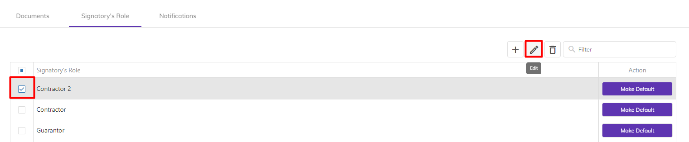<figcaption>
Click on the image to enlarge.
</figcaption></figure>

After generating the code, choose whether it will be sent via email or SMS, and provide the email or phone number for delivery. It is also possible not to send the code, allowing the user to inform the recipient in their preferred manner. To delete the created code, simply click on "**Delete Security Code**."

<figure><figcaption>
Click on the image to enlarge.
</figcaption></figure>

**Custom Message Icon:** By clicking on this icon, you can insert a message that will be sent to the recipient along with the document. To do this, fill in the "Subject" and "Message" fields. If you wish to delete the message, click on **"Delete Custom Message."**

<figure>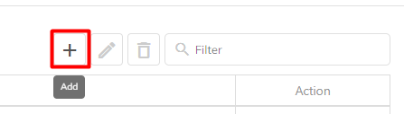<figcaption>
Click on the image to enlarge.
</figcaption></figure>

To add other recipients, click on the "Add New Recipient" button.&#x20;

To include yourself as a recipient, click on **"Add me as a recipient".** The name and email fields will be automatically filled with the information registered in your user profile, and the "Send via" field will be filled with the "Email" option.&#x20;

<figure><figcaption>
Click on the image to enlarge.
</figcaption></figure>

***

### C. Default Message

In the "**Default Message"** field, the default message to be sent to all recipients must be defined by filling in the "Subject" and "Message" fields.&#x20;


<mark style="color:orange;">**In the case of recipients who have the Custom Message fields filled, the provided message will be sent in place of the default message.**</mark>&#x20;


<figure><figcaption>
Click on the image to enlarge.
</figcaption></figure>

After completing these settings, click "Next" to proceed to the next step, "Save for Later" to save the document as a draft, or "Discard" to cancel the registration.

<figure>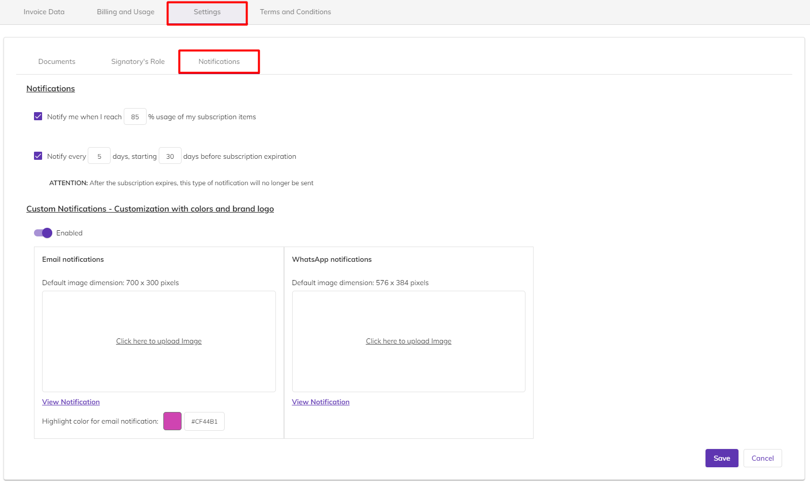<figcaption>
Click on the image to enlarge.
</figcaption></figure>

***

## Step 2: Configure Fields

In the next step, the documents inserted in the previous stage will be displayed in PDF format, and the areas where participants in the process should sign need to be configured.

<figure>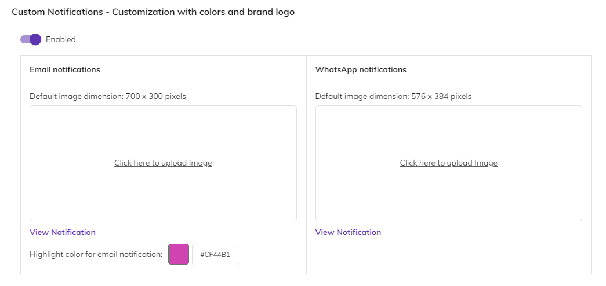<figcaption>
Click on the image to enlarge.
</figcaption></figure>

### Signature Fields&#x20;

In the right corner of the screen, choose between "**Manually position signatures**" to select where the signature areas will be placed in the document, or "**Automatically position signatures on a page at the end of the document**" so that all signatures are inserted at the end of the last page of the document.&#x20;

For each recipient added in the first step, it is necessary to configure the signature area. To do this, select the recipient in the "**Settings for**" field.&#x20;

<figure>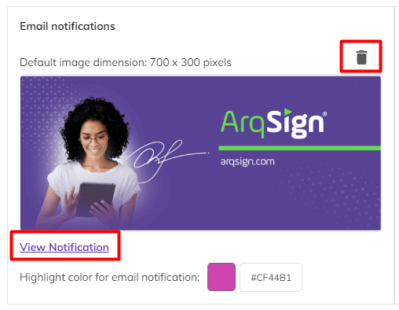<figcaption>
Click on the image to enlarge.
</figcaption></figure>

If the option "**Manually position signatures**" was chosen, the "**Signature Fields**" section will be displayed. To create the signature area, drag the "**Sign as**" box to the part of the document where you want the signature to be inserted.&#x20;

<figure>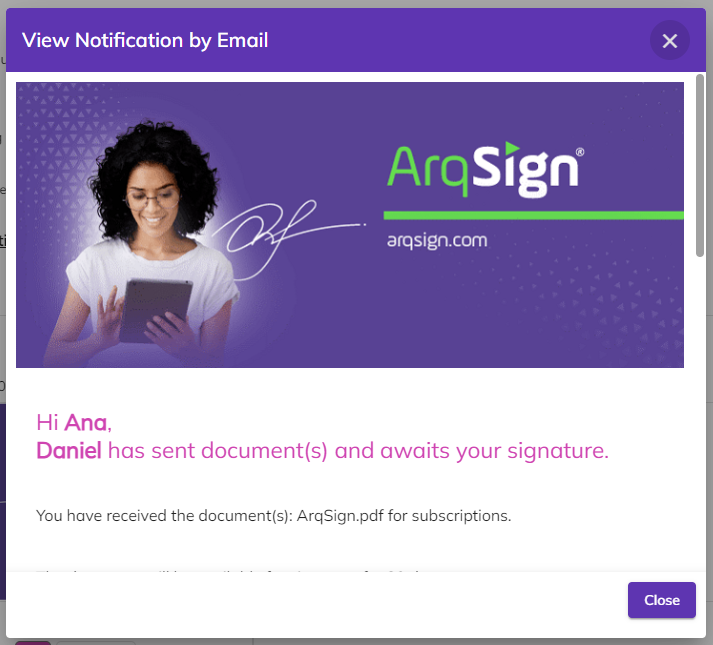<figcaption>
Click on the image to enlarge.
</figcaption></figure>

If the option "**Automatically position signatures on a page at the end of the document**" has been chosen, a page will be inserted at the end of the document where signatures and signatory information will be displayed in an orderly manner. The role that the signer has in the contract is also displayed.

If in step 1 it was defined that the recipient will sign as an individual and a legal entity, two boxes with their names in the same color should be inserted. The boxes for each of the recipients will be displayed in different colors to visually signal where each should sign.&#x20;


<mark style="color:orange;">**Note that the boxes for recipients are of the same color as shown in the "Settings for" field.**</mark>&#x20;


<figure>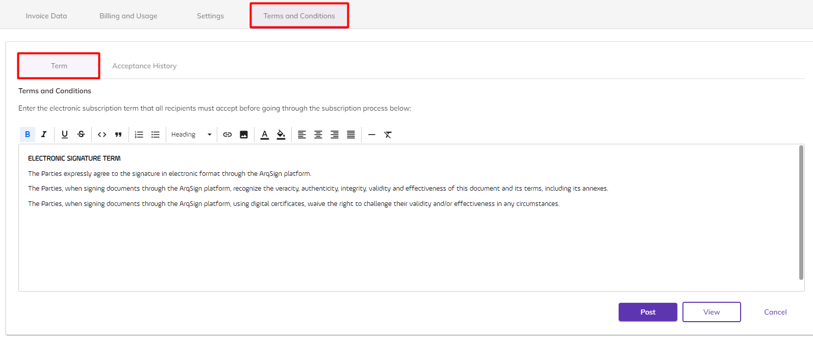<figcaption>
Click on the image to enlarge.
</figcaption></figure>

***

### Additional Signature Information&#x20;

Depending on the type of signature defined for the recipient in step 1, the "**Additional Signature Information**" fields will be displayed. These fields will only be shown if the option "Electronic Signature" was chosen in step 1 in the "Signature Type" field.&#x20;

If the signature is as an Individual, it is possible to require the recipient's name and some document by selecting the options "Individual's Name" and "Individual's Document" as mandatory fields.&#x20;

<figure><figcaption>
Click on the image to enlarge.
</figcaption></figure>

To require a document, select the desired option among CPF, CNH, RG, or others. If the last option is selected, you will need to provide the document's name, specify if it is text or numeric, and indicate the number of characters.&#x20;

If the signature is as a Legal Entity, it is possible to require the recipient's company name and some document by selecting the options "Legal Entity Name" and "Legal Entity Document" as mandatory fields.&#x20;

To require a document, select the desired option among Driver's License, Identity or others. If the last option is selected, you will need to provide the document name, specify whether it is text or numeric, and indicate the number of characters.

<figure><figcaption>
Click on the image to enlarge.
</figcaption></figure>

If the signature is as a Legal Entity, it is possible to require the recipient to provide the company's legal name and some document by checking the options "Legal Entity Name" and "Legal Entity Document" as mandatory fields.

***

### Attachments&#x20;

In the "Attachments" section on the left side of the screen, configurations will be displayed that allow recipients to attach other files to the document at the time of signing. To enable this, check the option "**Allow attaching documents**."&#x20;

Provide the name of the attachment that will be requested and specify whether it will be mandatory to fill in and if all participating recipients in the signature workflow will be able to view the file attached by the recipient.&#x20;

It is possible to request more than one attachment by clicking on the "**Add**" icon.&#x20;

<figure>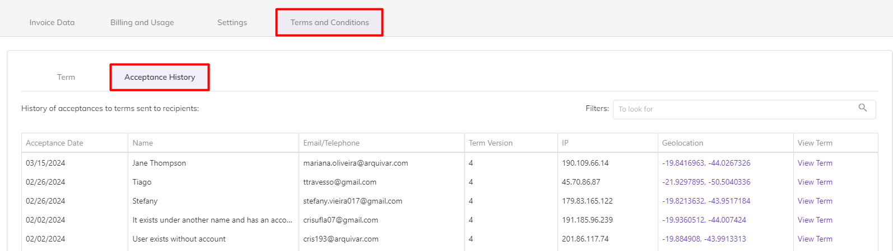<figcaption>
Click on the image to enlarge.
</figcaption></figure>

By clicking "**Delete,**" the document will be deleted. Clicking "**Save as Draft**" will save the document in the Drafts folder. To edit the document or recipients, click "**Previous Step**." Once the signature field configurations are completed, click "**Send**" to submit the document for the recipients' signatures.&#x20;

<figure><figcaption>
Click on the image to enlarge.
</figcaption></figure>
